# Automate Balance Confirmation Workflows in Financial Accounting with a Custom Joule Agent

## Prerequisites

- Access to **SAP Joule Studio** (SAP BTP tenant with Joule Studio enabled)
- Access to an **SAP S/4HANA Cloud** system with live business partner, GL account, and accounting document data
- Basic familiarity with Financial Accounting (FI) processes, in particular period-end and year-end closing activities

## You will learn

- How to recognise Finance workflows that are well-suited for agent automation
- How to write a focused **intent statement** for a balance confirmation processing agent
- How to review and validate a Joule Studio **Idea Board** - including reflected intent, problem statement, goals, and recommended solution
- How the generated **Product Requirements Document (PRD)** defines automation level, LLM boundaries, and operational guardrails
- How Joule Studio structures a solution using **separate MCP servers** per SAP OData API
- How to interpret the results of an **automated validation suite** before deployment
- How to deploy a production-ready agent to the SAP managed service


## Intro

>**IMPORTANT**
>
>**Welcome to the Agent lab**
>
>You are working with a pre-release version of the Joule Studio. This gives you an early look at our upcoming capabilities. Please keep the following in mind:
>
> - **Features are subject to change:** The UI, terminology, and functionality you see may differ from the final product.
> - **Educational use only:** This environment is designed for learning and experimentation, not for production use.
> - **Potential instability:** As a preview version, you may encounter occasional instability or unexpected behavior.

At period-end and year-end, Finance teams face a predictable but demanding task: responding to balance confirmation requests from customers and vendors. Requests arrive through multiple channels - email, postal letter, or a portal - in inconsistent formats, at peak volume, and with high compliance stakes. An incorrect or delayed response risks both audit exposure and damaged business relationships.

In this tutorial, you follow **Selina**, a Finance professional at fictional company **RaiLona Inc.**, as she uses **SAP Joule Studio** to build a custom AI agent that automates this workflow end-to-end. You will move through all six phases of the Joule Studio intent-based development process - from a plain-language intent statement through to a deployed Python agent integrated with SAP S/4HANA Cloud, SAP AI Core, and SAP BTP.

> **About the example company:** RaiLona Inc. is a fictional enterprise used throughout this tutorial to illustrate a realistic Finance scenario. All names, figures, and system configurations are illustrative.

> **What makes Finance workflows good candidates for agent automation?** Selina has identified a clear pattern in her team's work: the highest-effort manual workflows are triggered by predictable events, depend on live SAP S/4HANA data, follow deterministic processing logic, and require professional, traceable output. Balance confirmations match all four criteria - making them an ideal starting point.


---

### Understand the Business Challenge

Before building the agent, it is important to understand the problem it must solve. This describes the three types of balance confirmation request the Finance team handles, and the manual pain points the agent will eliminate.

**Three types of balance confirmation request**

Business partners submit balance confirmation requests through different channels, and the content of each request varies considerably. The Finance team at RaiLona typically encounters three distinct request types:

| Type | Description |
|------|-------------|
| **Verification request** | The business partner sends an existing balance confirmation and asks RaiLona to verify it against its own records. |
| **Balance list request** | The business partner requests that RaiLona provide a full balance list as of a specific reference date. |
| **Exception-only request** | The business partner requests a response only if discrepancies exist between their submitted figures and RaiLona's records. |

**Current pain points**

The manual handling of these three request types creates the following well-understood operational challenges:

- **Tool-switching overhead** - Finance staff must switch between communication channels, ERP transactions, and document editors to complete a single request.
- **Time-consuming lookups** - Manual lookup and comparison of open items is slow, particularly at period-end when request volumes peak.
- **Inconsistent response letters** - Drafting letters by hand introduces variability in tone, format, and legal language across responses.
- **Fragmented audit trail** - Tracking open requests and maintaining a complete audit trail requires additional manual effort outside the core workflow.
- **Partner follow-up load** - Delayed or incomplete responses prompt follow-up inquiries from business partners, adding to the team's workload.

> The agent you build in this tutorial eliminates all five pain points by automating ingestion, classification, reconciliation, and letter generation - with human review required only for discrepancy and dispute cases.


### Open Joule Studio and Define the Agent Intent

Select the solution type you want to create, in this case Agent, and describe what you want to build. Joule will take your **intent** and translate it into a product requirements and technical specifications and finally implement the solution.

1. Open **SAP Joule Work** and choose **Joule Studio** in the left navigation panel.

2. Select **Create** to open the **Create Agent** dialog. If this is not your first project in Joule Studio, select **+ New** in the **Solutions** panel to access the dialog.


3. Complete the three fields in the dialog:

    - **Solution**: Select **New Solution** to create this agent as a standalone solution.
    - **Name**: Enter the following agent name:
        ```
        Automated Processing of Balance Confirmations
        ```
    - **Intent Statement**: Enter the following statement in plain business language:
        ```
        Please create an agent. The agent should automatically process incoming balance confirmation requests from business partners and generate
        appropriate, legally compliant response letters. The objective is to reduce processing time, minimize follow-up inquiries, and improve the
        quality and traceability of communication.
        ```
    - Check **Quick Create** option. This will skip answering clarifying questions and directly move towards solution building. 

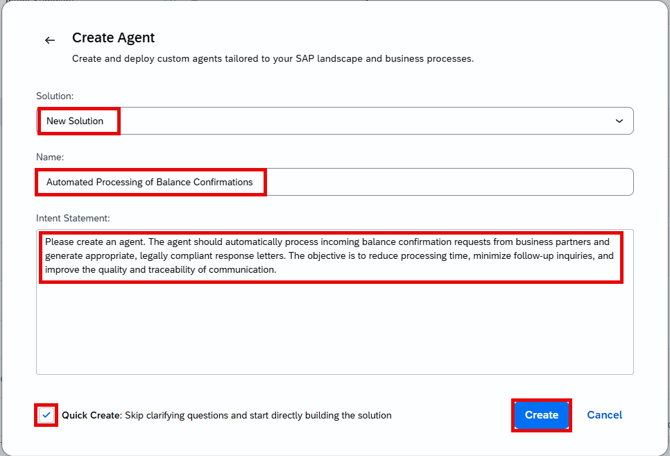

> **The most important input in the entire process is the intent statement.** Frame it around the *business outcome* you want to achieve, not the technical steps. Joule Studio derives the full technical design from your stated intent. If the generated Idea Board does not accurately reflect your goal, return here and refine the statement before continuing.

4. Select **Create** to proceed.

5. Confirm the Business Goals.

Even when **Quick Create** is selected, Joule will collect the mandatory Business Goals & Success Criteria before completing the intent analysis. Answer any additional clarifying questions to the best of your knowledge - these inputs help Joule define the success metrics and tailor the generated PRD.

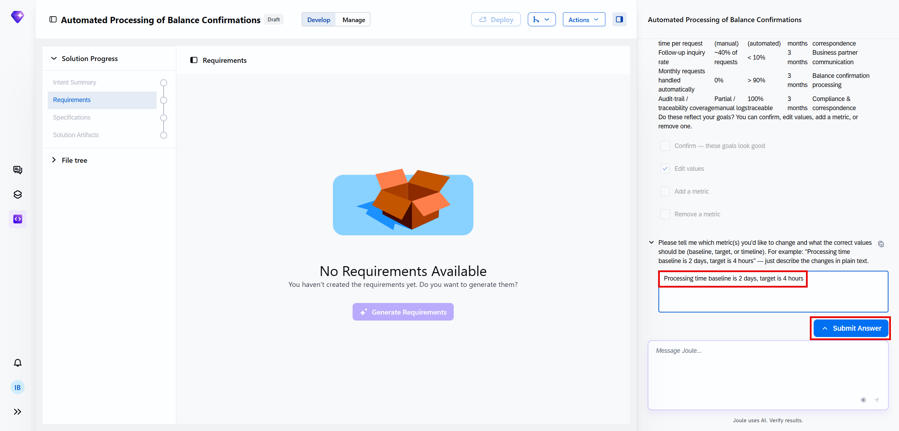

### Review the Intent

1. After you submit the intent statement, Joule Studio generates an **intent.md** and presents a summary.

2. Under the **Intent Summary** tab, you may review the complete summary. This shows how Joule Studio interpreted your input.

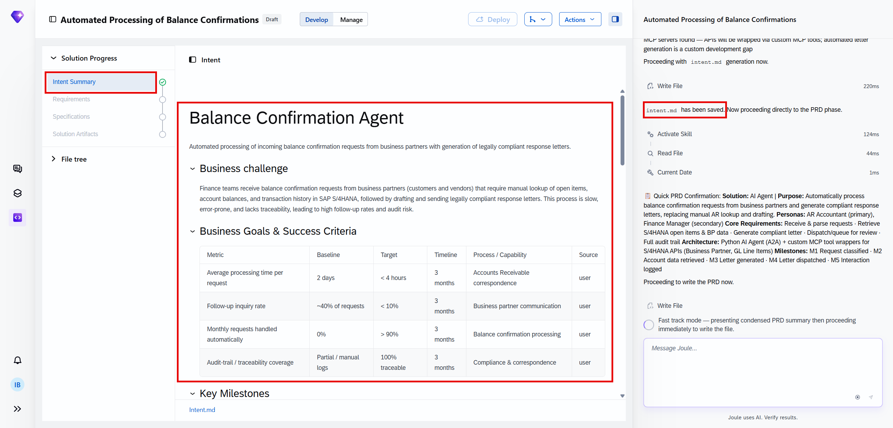

3. Verify that this matches your intent. If the summary is missing an element or describes a different scope, you can refine the intent statement and re-submit.

4. You can also find the **intent.md** file under **File tree** panel.

5. Scroll down to the **Fit Gap Analysis** and see what Joule has identified.

6. Then you can scroll down to the **Recommended Solution**. It describes a Python-based agent with a dedicated deterministic optimisation engine (cutting stock algorithm) separated from the LLM narration layer, and what the agent should be able to do.

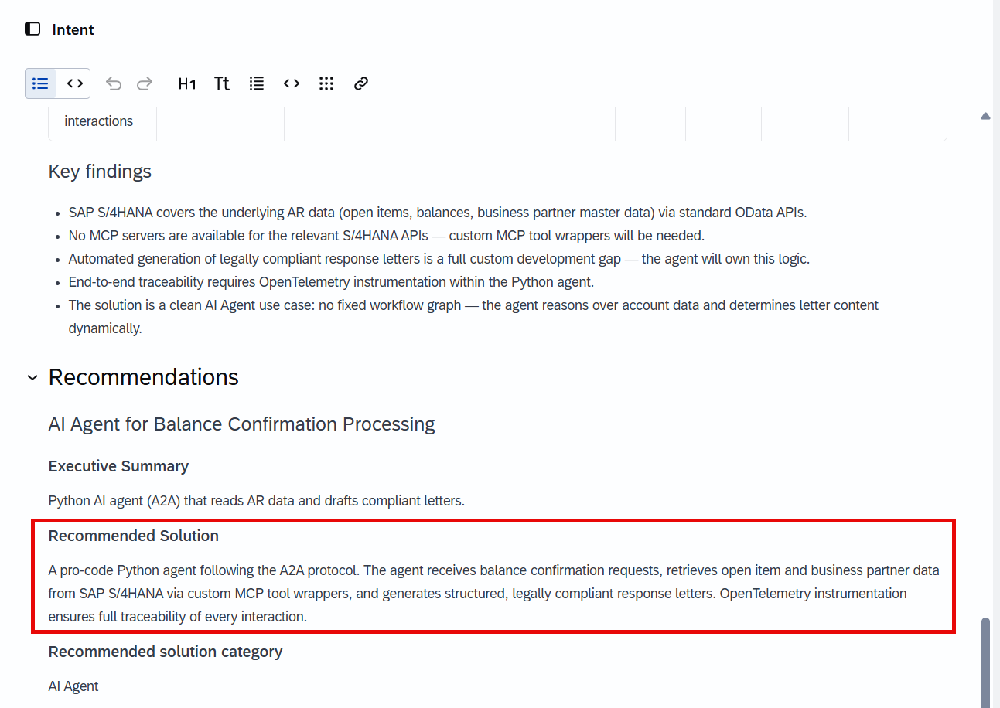

### Product Requirements Document

In the **Requirements** phase, Joule Studio generates a full **Product Requirements Document (PRD)**. The PRD formally captures what needs to be built, why it is needed, and how the agent is expected to behave. It serves as the contractual record between the business intent and the technical build.

1. Wait until the requirements have been generated.

2. Choose **Requirements** under **Solution Progress** panel. This opens the low-code view of the PRD.

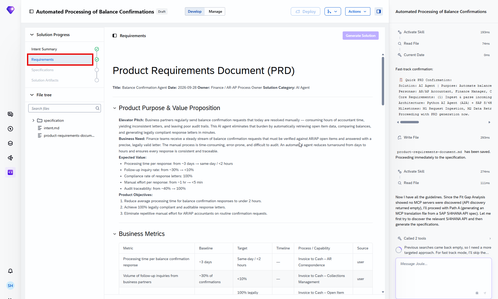

Check the document. It consists of several sections:

**Product Purpose and Value Proposition**

| Section | Content |
|---------|---------|
| **Elevator Pitch** | Finance teams waste significant time manually processing incoming balance confirmation requests - looking up open items in SAP, reconciling figures, and drafting response letters. This AI agent automates the entire process, with human review only for exceptions. |
| **Business Need** | No standard SAP product handles automated ingestion, classification, or compliant letter generation for balance confirmation requests. The current manual process is slow, inconsistent, and difficult to audit - particularly at period-end and year-end when volumes peak. |
| **Expected Value** | Significantly reduced processing time per request; fewer follow-up inquiries due to consistent, complete response letters; a full audit trail for every request and response; improved compliance with localization and legal requirements. |

**Product Objectives (in priority order)**

1. Automate classification of incoming balance confirmation requests and reconciliation with SAP data.
2. Generate localized, legally compliant response letters without manual drafting.
3. Ensure full traceability and audit-readiness of all communications.

**Automation Level and Agent Behaviour**

The Balance Confirmation Agent operates at a **hybrid automation level**: it handles fully matching cases autonomously and routes discrepancy or dispute cases to a human before dispatching a response.

*Autonomous actions (no human required):*
- Ingest incoming requests from email or document upload
- Fetch open items, GL account line items, and balances from SAP S/4HANA
- Reconcile stated figures against live SAP data using the deterministic engine
- Dispatch response letters for **fully matching confirmations**

*Human review required for:*
- Cases where the discrepancy between stated and SAP figures exceeds the configured threshold
- Requests classified as **dispute-indicated**

**LLM boundaries**

Request classification and response letter generation are handled by an LLM via **SAP Generative AI Hub**. Balance reconciliation uses a **deterministic rule-based engine**. All SAP S/4HANA Cloud API access is strictly **read-only**, covering accounting documents, GL account line items, and business partner data.

**Guardrails**

Four operational guardrails are built into the agent:

1. **No financial data is ever modified** - all S/4HANA API calls are read-only.
2. **Low-confidence classifications** are automatically escalated to human review.
3. **API unavailability** triggers request queuing and a notification to the Finance team.
4. **All outbound letters** must pass template validation before dispatch.

The result you get from your experience may be different from this requirements example. Make sure, the requirements generated for your solution are meeting your expectation.  

Once you have reviewed the PRD and confirmed it accurately reflects your requirements, you can start the next phase of the project if it's not started automatically.

**Solution Architecture**

In the solution architecture section you will see the proposed components and the integration points. The main components are: the agent itself, dedicated MCP servers to access the SAP S/4HANA backend, and SAP AI Core to enable LLM access for the agent.

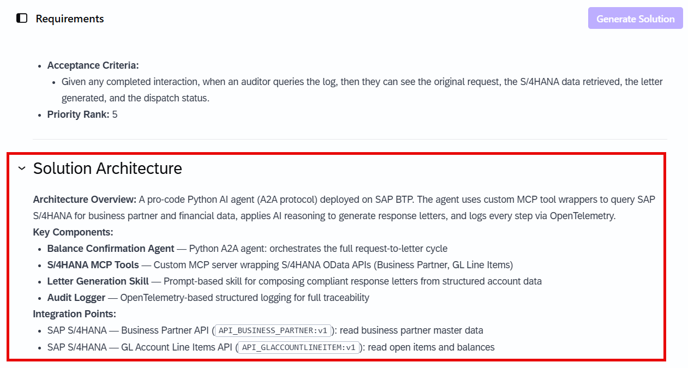

### Inspect the Generated Specification

In the **Specification** phase, Joule Studio translates the PRD into a structured set of technical artifacts - the complete blueprint from which the agent will be built. You do not write any of these artifacts manually; they are generated entirely from the intent and requirements you approved.

Wait for the specification generation to complete.  Review the summary of what has been created so far by choosing **Specification** under **Solution Progress**:

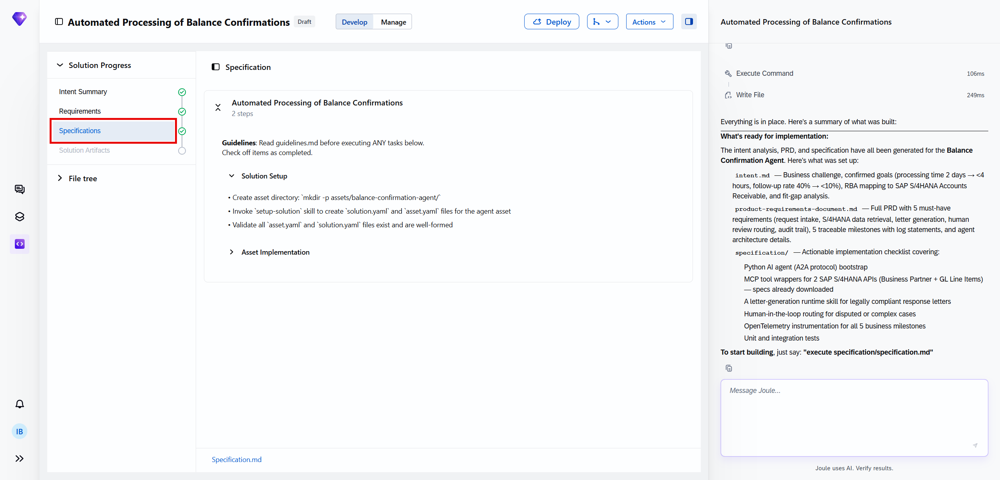

> **Architecture note:** Unlike agents that bundle all SAP API access inside a single component, the Balance Confirmation Agent uses **separate MCP servers** for each SAP OData API it consumes. This is the standard pattern when an agent needs to call multiple distinct SAP APIs - each server wraps one API and exposes it to the agent in a structured, LLM-interpretable format.

**Example of the `assets/` folder**

```
assets/
├── balance-confirmation-agent/          # Core agent: reconciliation logic, LLM prompts,
│                                        # classification, letter generation, routing rules
├── sap-s4-business-partner-mcp-server/  # MCP server: Business Partner API
│                                        # (business partner master data)
├── sap-s4-glaccountlineitem-mcp-server/ # MCP server: GL Account Line Items API
│                                        # (open items and line-level balance data)
└── sap-s4-oplacctgdocitemcube-server/   # MCP server: Accounting Documents API
                                         # (accounting document header and item data)
```

> **What is MCP?** MCP stands for **Model Context Protocol** - the standardized communication layer that allows an AI agent to interact with external systems such as SAP S/4HANA in a structured and secure way. Each MCP server wraps an individual SAP OData API and exposes it to the agent in a format the LLM can interpret and invoke. The three MCP servers here give the agent access to everything it needs to perform a full balance reconciliation without any direct database access.

### Generate the Solution

1. Once the specification is ready, Joule Studio will proceed with the solution generation. Sometimes it may still wait for your input. In this case just type `execute specification` in the coding agent chat.

In the **Solution** phase, Joule Studio executes the specification and generates the complete, runnable solution. The agent code, the three MCP server integrations, the reconciliation logic, and the letter generation components are all assembled from the blueprint defined in Phase 3. No manual development is required.

2. Wait for the solution generation to complete before proceeding. You can find the agent under **Solution Artifacts**.

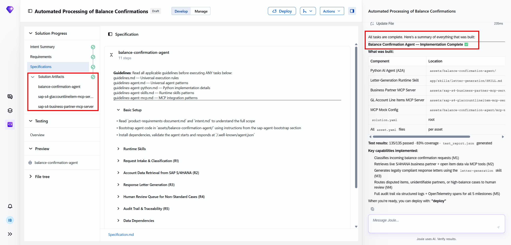

During this phase, Joule Studio:

- Scaffolds the full Python agent and the MCP server packages based on the `assets/` tree.
- Wires up the SAP OData API bindings defined in `solution.yaml` for each MCP server.
- Configures the **SAP Generative AI Hub** connection for LLM-based classification and letter generation.
- Implements the four operational guardrails defined in the PRD.
- Instruments all agent actions with audit logging.

**Reviewing the Agent Definition**

3. Select the agent under **Solution Artifacts** to open its definition. In the low-code view you can see:

- The LLM configuration (e.g., sap/anthropic--claude-4.5-sonnet)
- Agent Configurations: circuit-breaker threshold, thread TTL, summarization trigger
- The MCP Servers that allow the agent to access Business Partner, GL Account and Accounting Document data from SAP S/4HANA

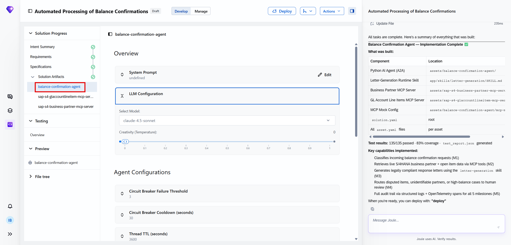

4. In the **Evaluation** section you can generate evaluation scenarios for this agent based on your intent.

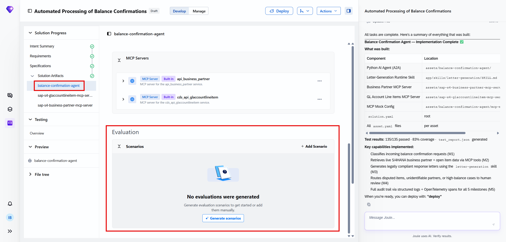

5. To see the generated Python code, move to the pro-code (File tree) view.

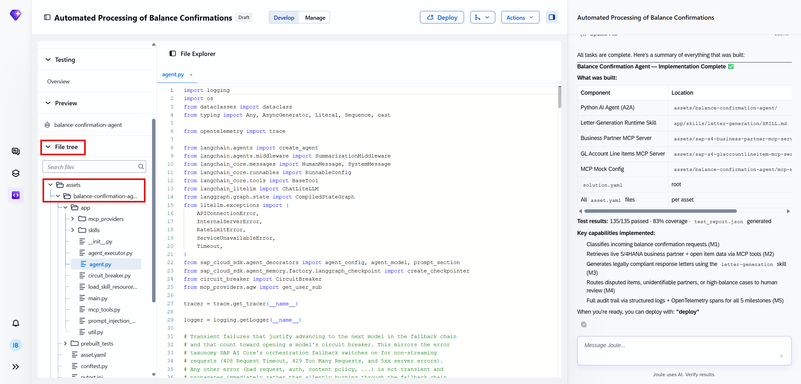

6. Select **MCP Servers** in the agent definition to see the servers that were configured automatically. Each one gives the agent access to a specific system:

- **Business Partner MCP server**: When a balance confirmation request arrives, the agent needs to know who is asking. This connector answers questions like:
    - Is this a known business partner in our system?
    - What are their contact details, company name, and address?
    - Are they linked to a customer or vendor account?
    
    Without this, the agent couldn't verify the identity of the requesting company — a critical step before disclosing any financial data.
- **GL Account Line Items MCP server**: Once the partner is identified, the agent needs to know what they owe or are owed. This connector retrieves:
    - All open invoices and credit memos on the account
    - Outstanding balances at a specific date (the confirmation date)
    - Document references — so every figure in the letter is traceable back to a real posting in SAP

    This is the financial "source of truth" that the generated letter is based on.

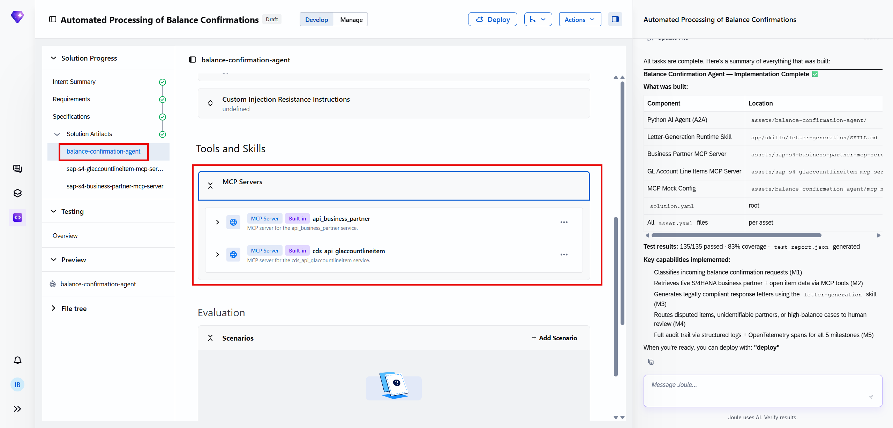

No configuration is required: Joule Studio generated and wired up all servers from the specification.

Once Joule confirms the solution build is complete, proceed to **Testing Overview** to see the automated test results.

> If Joule Studio reports a warning about the Batch Stock MCP server scope during generation, check that the storage location codes in `solution.yaml` match the location identifiers in your SAP S/4HANA plant structure. A mismatch here will cause the stock query to return empty results in testing.

### Validate the Agent

The **Testing** phase is triggered automatically by Joule once the solution build is complete. It runs an automated validation suite derived from the specification - you do not need to initiate it manually. Wait for Joule to confirm that testing has finished before proceeding.

1. Once testing is complete, open **Overview** under **Testing** panel. Review the results and compare the test categories to your specification to verify all requirements have been validated.

2. Verify that all tests pass before proceeding to deployment.

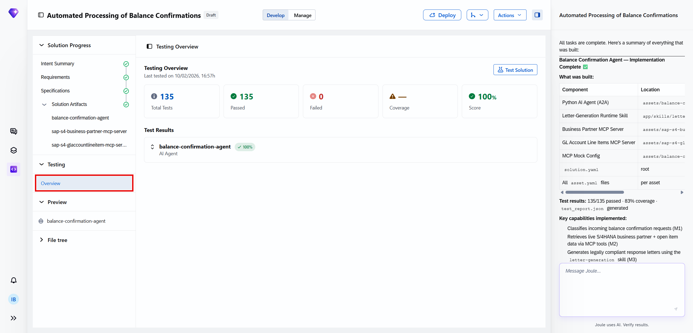

> If any test fails, Joule will usually try to fix it automatically. If it gets stuck, you might converse with Joule to help fix the problem.

3. Select the agent under **Preview** panel.

4. In the chat field, enter a prompt that does not require live tool calls. For example: *Please process this balance confirmation request: Acme Corp GmbH, business partner 1000123, is requesting confirmation of their open balance as of today.* The agent will respond with a description of its capabilities without needing to connect to SAP S/4HANA.

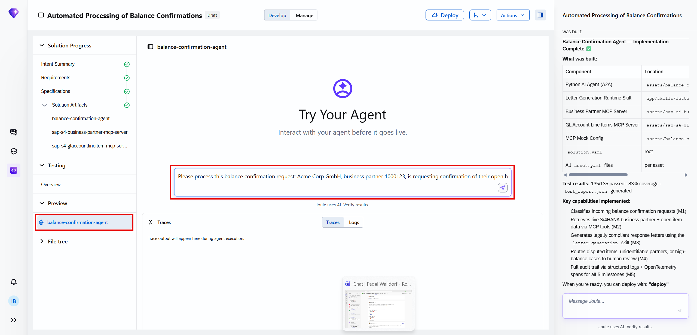

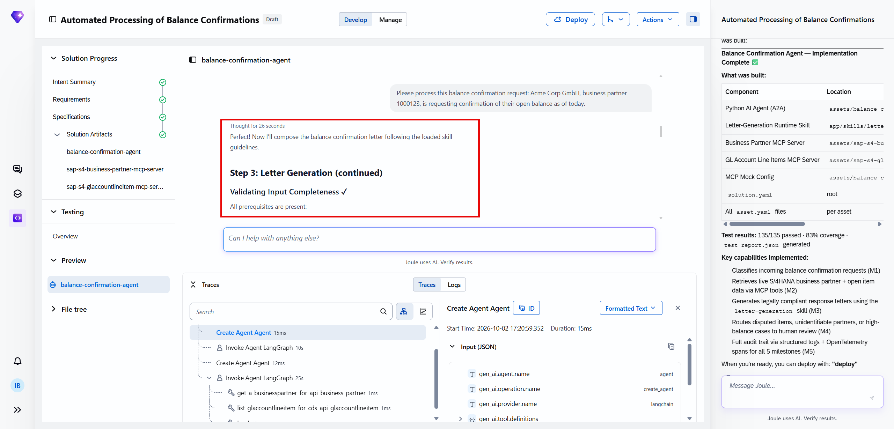

You can do some further testing before deployment.

### Deploy the Agent to Production

With all tests passed and the validation score confirmed, the **Automated Processing of Balance Confirmations** agent is ready for deployment.

1. Choose **Deploy**. Then confirm with **Deploy** again.

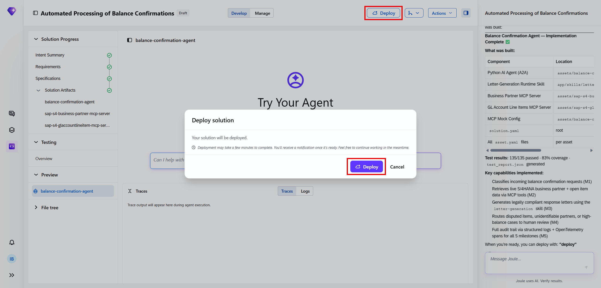

2. Joule Studio packages the agent and deploys it to the **SAP managed service** - the shared infrastructure that handles compute, scaling, connectivity, and runtime management for all Joule Studio solutions. You do not need to provision or operate any infrastructure manually.

3. Once deployment completes, the `deploy_result.json` file in the `specification/` folder is populated with the live deployment details (endpoint URL, runtime ID, deployment timestamp).

Your agent is now operational.

**How the agent works in production**

Once live, the agent processes incoming balance confirmation requests automatically:

1. **Ingestion** - The agent detects an incoming request via email or document upload and ingests it.
2. **Classification** - The LLM classifies the request as a verification request, balance list request, or exception-only request.
3. **Data retrieval** - The agent calls the three MCP servers to fetch relevant open items, GL account line items, and accounting documents from live SAP S/4HANA data.
4. **Reconciliation** - The deterministic engine compares the business partner's stated figures against the SAP data as of the stated reference date and flags any discrepancies.
5. **Letter generation** - The LLM drafts a localized, legally compliant response letter for the specific request type and reconciliation outcome.
6. **Routing decision**:
   - **Fully matching**: The response letter is dispatched automatically.
   - **Discrepancy or dispute**: The case is routed to a Finance team member for review and approval before the letter is sent.
7. **Audit logging** - Every request receipt, classification decision, reconciliation result, routing decision, and letter dispatch is logged for full audit traceability.

> The Finance team at RaiLona can query the audit log at any time to retrieve a complete, linked record of every balance confirmation request from ingestion to response - demonstrating audit-readiness to auditors and compliance teams.

**Monitoring the Agent**

Once deployed, switch to the **Manage** tab in Joule Studio to access governance and monitoring. Here you can view runtime status, active deployments, usage metrics, and audit logs.

### Summary

You have completed the end-to-end creation and deployment of an Automated Processing of Balance Confirmations agent using SAP Joule Studio. In doing so, you have:

- Identified the three types of balance confirmation request (verification, balance list, exception-only) and the five manual pain points they create
- Written a focused intent statement that Joule Studio translated into a structured, production-ready solution
- Reviewed and validated an Idea Board, including the reflected intent, problem statement, five measurable goals, and a recommended architecture with a 92% intent fit score
- Evaluated a generated PRD, including product objectives, automation level, LLM vs. deterministic engine boundaries, read-only API access scope, and four operational guardrails
- Inspected a generated file tree structured with **MCP servers** - for SAP OData APIs - and understood the role of each component
- Interpreted a 42-test validation suite covering both unit tests and AI-powered evaluations, with a 100% pass rate
- Deployed the agent to the SAP managed service and understood its end-to-end production behaviour - from ingestion to automatic dispatch or human-review routing

The agent turns what was previously a multi-step manual process - spanning multiple systems, tools, and document editors - into a **guided, auditable, compliant workflow** that Finance teams can rely on at every period-end and year-end close.
