# Automate Budget Variance Management for Cost Centers with a Custom Joule Agent

## Prerequisites

- Access to **Joule Studio**
- Access to an **SAP S/4HANA Cloud** system with financial planning data and cost center hierarchy configured


## You will learn

- How to identify a real-world finance automation use case suitable for a Joule Agent
- How to write an effective **intent statement** for an agent
- How to review and validate the assets created, including the generated **Product Requirements Document (PRD)**
- How to deploy a production-ready Joule Agent to the SAP managed runtime service


## Intro

>**IMPORTANT**
>
>**Welcome to the Agent lab**
>
>You are working with a pre-release version of the Joule Studio. This gives you an early look at our upcoming capabilities. Please keep the following in mind:
>
> - **Features are subject to change:** The UI, terminology, and functionality you see may differ from the final product.
> - **Educational use only:** This environment is designed for learning and experimentation, not for production use.
> - **Potential instability:** As a preview version, you may encounter occasional instability or unexpected behavior.

Finance teams regularly face time-critical budget disruptions mid-fiscal year. A sudden energy price spike, a supplier surcharge, or a commodity cost event can impact dozens of cost centers simultaneously - triggering a manual, multi-day process of detection, analysis, approval, and write-back that is slow, error-prone, and leaves no structured audit trail. In this tutorial, you take the role of a finance controller who wants to build a custom AI agent using **Joule Studio** to automate this entire workflow end-to-end. You will move through the phases of the Joule Studio intent-based development process - from a plain-language intent statement through to a deployed, production-ready Python agent that integrates directly with SAP S/4HANA Cloud.


### Understand the Business Challenge

**Current pain points**

The manual handling of budget disruption events creates the following operational challenges:

- **No automated detection** - Finance staff must monitor multiple reports and transactions to spot a cost anomaly. There is no threshold alert or trigger.
- **Manual hierarchy traversal** - Identifying all affected cost centers requires manually cross-referencing the cost center hierarchy against financial planning data, which is time-consuming and error-prone.
- **Spreadsheet-based recalculation** - Revised budget proposals are typically calculated in spreadsheets, introducing inconsistency and formula error risk.
- **Manual approval communication** - Drafting comparison charts and professional approval emails can take Selina several hours under active budget pressure.
- **No consolidated audit trail** - Applying budget revisions one-by-one in SAP S/4HANA provides no linked record connecting the approval decision to each write-back.

**Categories of budget disruption event**

When a significant cost event hits mid-year, it typically falls into one of three patterns:

| Type | Description | Example |
|------|-------------|---------|
| **Spot increase** | A one-time external cost event that raises actual spend for one or more isolated fiscal periods. The impact is bounded and predictable once the event is confirmed. | Emergency supplier surcharge, sudden energy price spike |
| **Sustained increase** | A structural change in a cost driver that raises the baseline for all remaining fiscal periods in the year. | New energy tariff, long-term supplier price adjustment, regulatory levy |
| **Cascade increase** | A cost event originating in a shared service centre or infrastructure cost center that ripples through the hierarchy, affecting all dependent cost centers. The impact must be traced and apportioned. | Shared infrastructure cost increase affecting all consuming business units |


> The agent you build in this tutorial should eliminate all five pain points by automating detection, analysis, communication, and write-back - while keeping a human approval gate before any data is written to S/4HANA.


### Open Joule Studio and Define the Agent Intent

The first phase in Joule Studio is **Intent**. You describe what the agent should do in plain language, and Joule Studio derives a structured solution from your input.

1. Open **Joule Studio**.

    <!-- border -->
    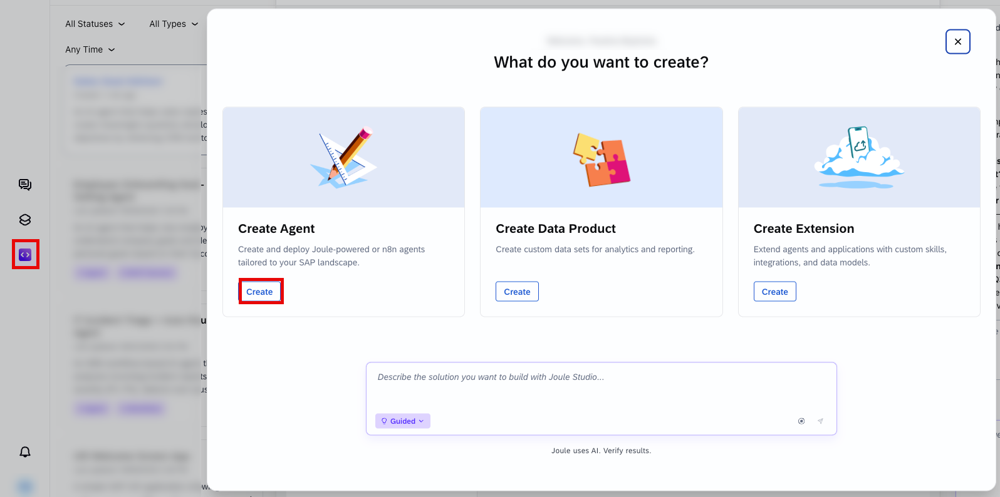

2. Select **Create** to open the Create Agent dialog.


3. Enter the agent name:

    ```
    Budgeting Agent for Cost Center Increases
    ```

4. Enter the following intent statement in the description field:

    ```
    Please create an agent. The agent should detect unexpected cost increases
    (e.g., energy price hikes), validate event details, and identify affected
    cost centers. It proposes a revised plan and budget adjustments for the
    remaining fiscal periods, including clear calculations, assumptions, and
    forecast deltas. It drafts approval communications to decision makers with
    a professional email template and an embedded chart comparing the original plan
    vs. revised plan vs. forecast. Upon approval, it applies the prepared budget
    updates, logs actions for auditability, and supports configuration for
    thresholds, scenarios, and time granularity.
    ```

5. Select **Quick Create**. This adds *Fast Track* to the intent statement.

    <!-- border -->
    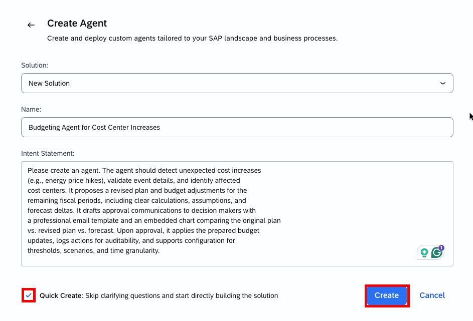

6. Select **Create** to proceed.

> **Writing a good intent statement**
>
> A strong intent statement describes *what* the agent does, *what data* it works with, *what decisions* it supports, and *what guardrails* it must respect. The statement above covers all four dimensions. If Joule Studio's interpretation of your intent does not match your expectations, return here and refine the statement before continuing.

7. Confirm the business goals.

    <!-- border -->
    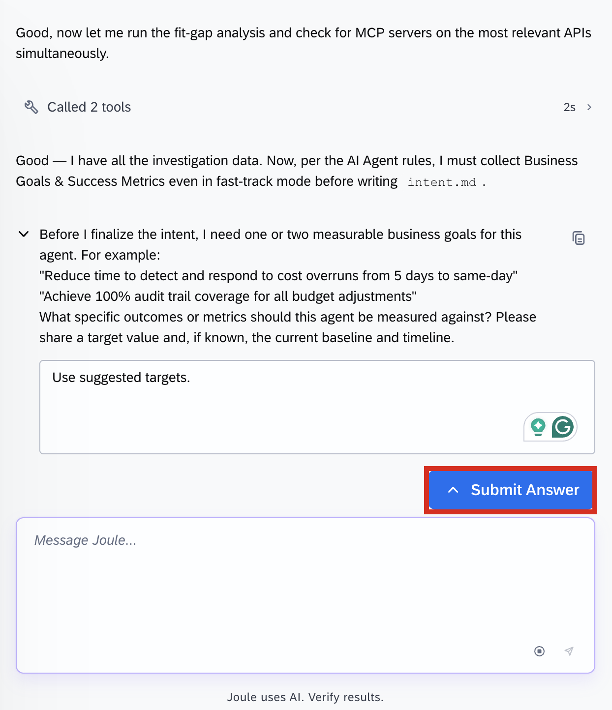

    Even when Quick Create is selected, Joule will collect the mandatory Business Goals & Success Criteria before completing the intent analysis. Answer any additional clarifying questions to the best of your knowledge - these inputs help Joule define the success metrics and tailor the generated PRD.


### Review the Intent

1. After you submit the intent statement, Joule Studio generates an **intent.md** and presents a summary in the chat. Review this summary before proceeding to the *Requirements* phase.

2. Under the **Intent Summary** tab, you may review the complete summary. This shows how Joule Studio interpreted your input.

    <!-- border -->
    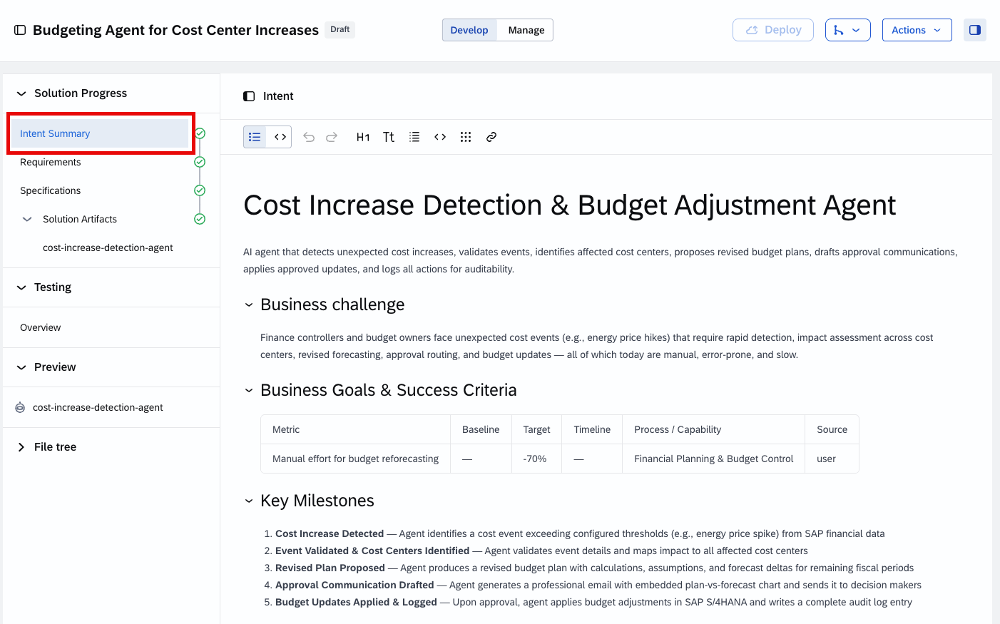


2. Verify that this matches your intent. If the summary is missing an element or describes a different scope, you can refine the intent statement and resubmit. 


3. You can find the intent.md file under File tree panel.

    <!-- border -->
    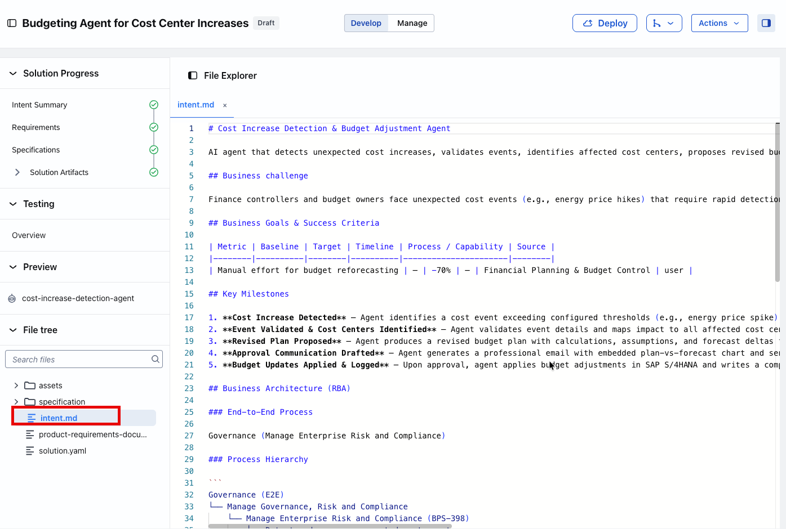


3. Scroll down to the Fit Gap Analysis and see what Joule has identified. Then you can scroll down to the Recommended Solution. It describes a Python-based AI agent that uses the Agent-to-Agent (A2A) and what it should be able to do.

5. At the bottom of the solution card, review the Intent fit score. A score of 90% or higher confirms a very high degree of alignment between the proposed solution and your original intent statement. If the score is lower, consider refining your intent statement.

    <!-- border -->
    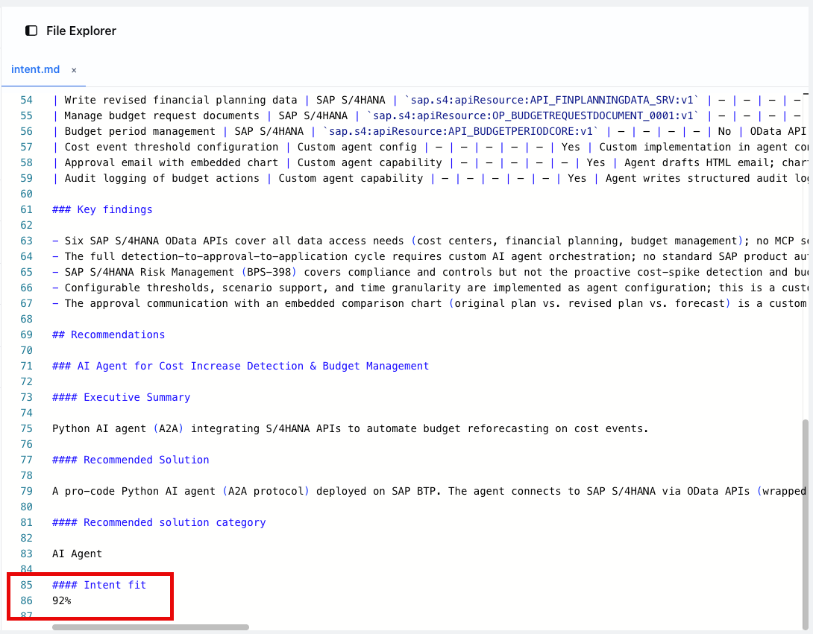


### Product Requirements Document

In the **Requirements** phase, Joule Studio generates a **Product Requirements Document (PRD)**. This is an important document that you are expected to review each section carefully - this document defines the agent's operational boundaries and becomes the source of truth for all subsequent phases.

1. Wait until the requirements have been generated. Choose **Requirements** under **Solution Progress** panel. This opens the view of the PRD.


    <!-- border -->
    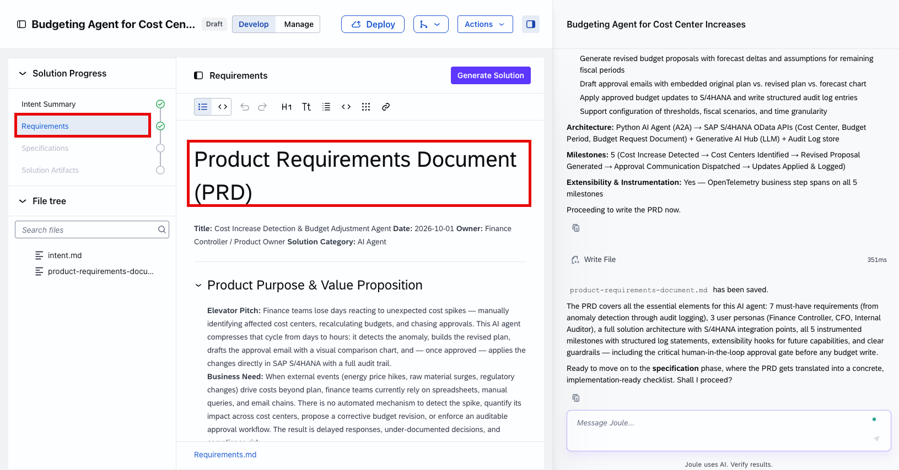


2. To access the raw Markdown file, move to the File tree panel - this is the code view of the same document.

    <!-- border -->
    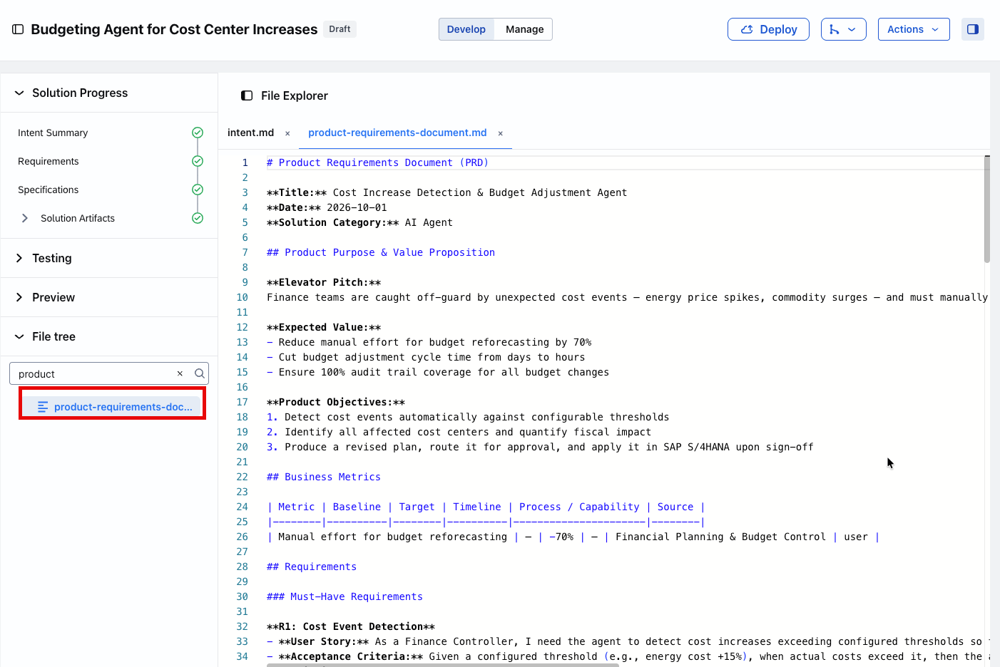

The Business Context section maps your intent to the actual business process - it identifies personas (e.g., sales rep, manager), pain points, success metrics, and guardrails. Review this section carefully: it defines the operational boundaries the agent will respect throughout all subsequent phases.


**Product Purpose and Value Proposition**

At the top of the document, you will find the elevator pitch, the business need, and expected value described. The product objectives are also listed.

**Must-Have Requirements**

2. Scroll down and expand the **Requirements**.

    <!-- border -->
    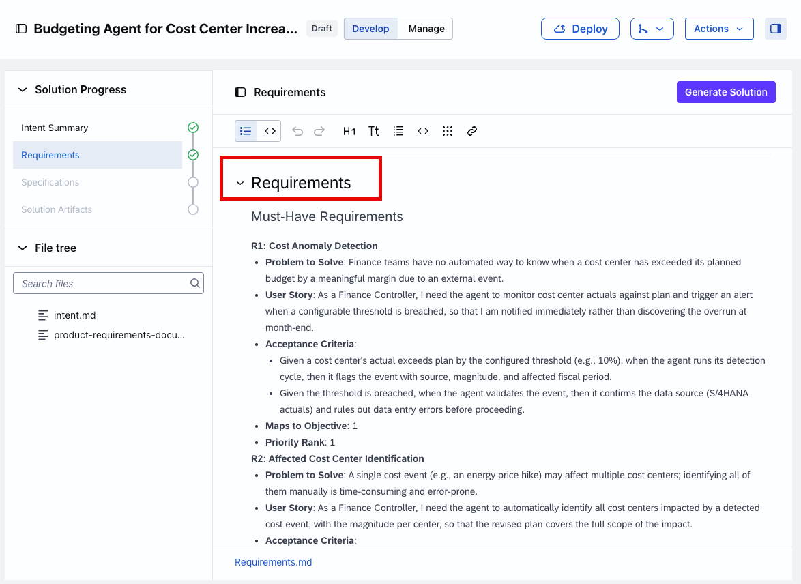

This section provides ranked requirements, with their user stories and acceptance criteria.

**Automation Level and Agent Behaviour**

3. Scroll down and expand the **Solution Architecture**.

    <!-- border -->
    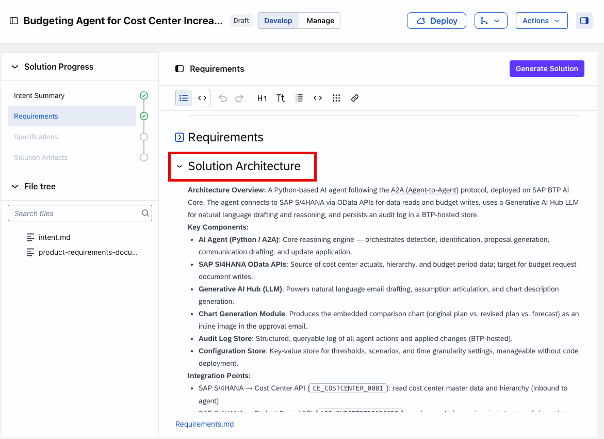

This section is critical - it defines exactly what the agent does autonomously, what requires a human decision, and what guardrails are in place.

The agent operates at a **hybrid automation level**:
- *Autonomous actions (no human required)*, such as detect cost anomalies against configured thresholds
- *Human approval required*, such as writing revised budgets back to SAP S/4HANA.


### Inspect the Generated Specification

In the **Specification** phase, Joule Studio translates the PRD into a generated file tree - a complete, structured, and reviewable set of assets and configuration files. No code has been written yet; this is the blueprint.

1. Wait for the specification generation to complete. Review the summary of what has been created so far.

    <!-- border -->
    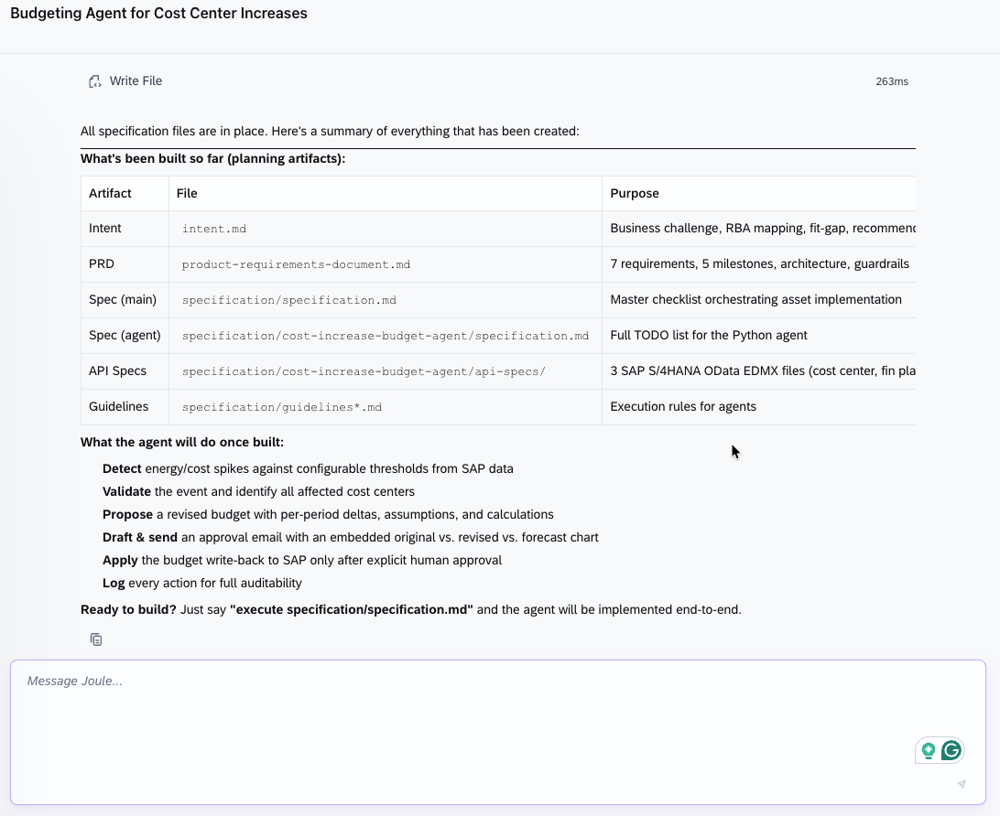


3. Go to **the `specification` folder**. The entire specification is transparent and reviewable before any deployment is triggered.


    <!-- border -->
    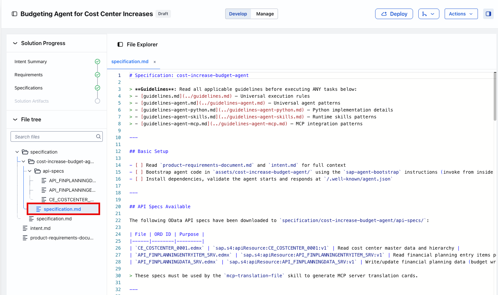


### Generate the Solution

1. In the **Solution** phase, Joule Studio executes the specification and generates the complete, runnable solution.


1. Once you have reviewed the specification, type **Build the solution** in the message window to trigger solution generation. Wait for the solution generation to complete before proceeding.

    <!-- border -->
    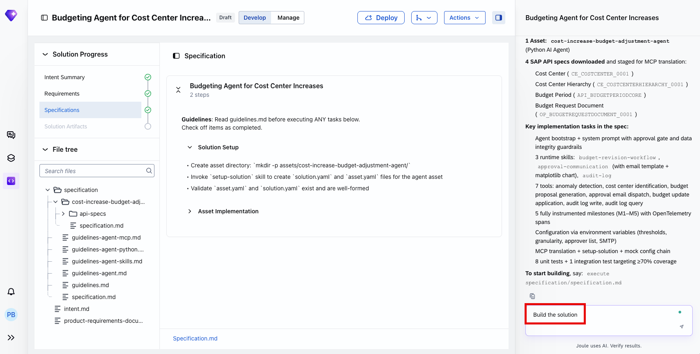

2. Once ready, you can find the agent under **Preview**.

    <!-- border -->
    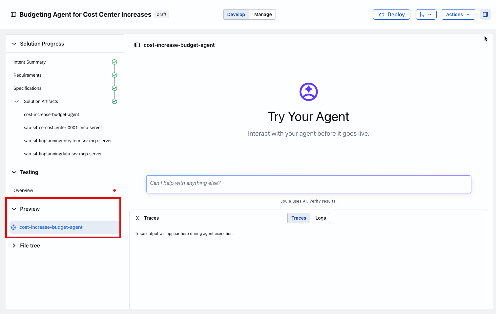


3. Reviewing the Agent Definition. Select the agent under **Solution Artifacts** to open its definition. In the low-code view you can see:
- The LLM configuration 
- Agent Configurations
- The MCP Servers 
 
    <!-- border -->
    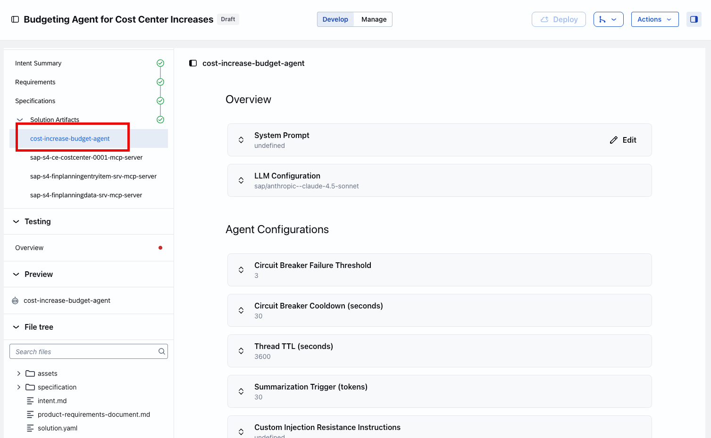


4. In the Evaluation section you can generate evaluation scenarios for this agent based on your intent. This may take a few minutes.

    <!-- border -->
    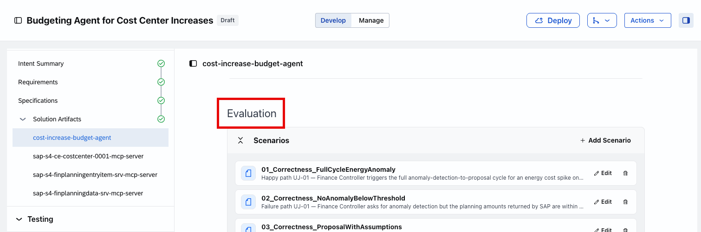


Once Joule confirms the solution build is complete, proceed to Testing Overview to see the automated test results.


### Validate the Agent with Automated Tests

The **Testing** phase is triggered automatically by Joule once the solution build is complete. It runs an automated validation suite derived from the specification - you do not need to initiate it manually. Wait for Joule to confirm that testing has finished before proceeding.

1. Open **Overview** under **Testing** panel.

    <!-- border -->
    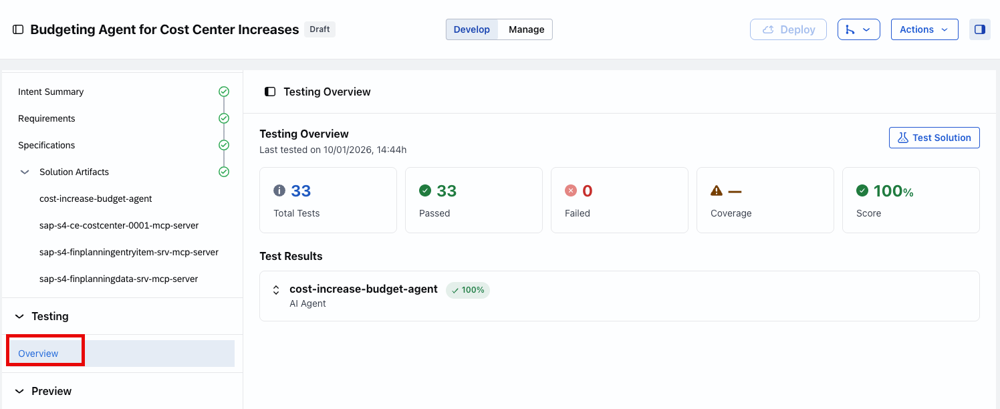
Review the results and compare the test categories to your specification to verify all requirements have been validated.

2. Choose **Test Solution**.

    <!-- border -->
    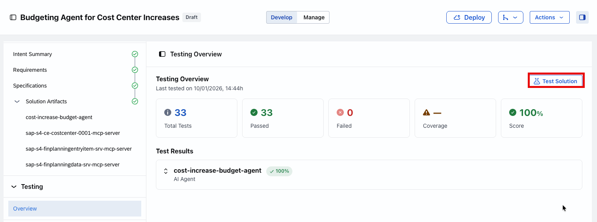
Verify that all tests pass before proceeding to deployment.

> If any test fails, Joule will usually try to fix it automatically. If it gets stuck, you might converse with Joule to help fix the problem.

3. Select the agent under **Preview** Panel.

    <!-- border -->
    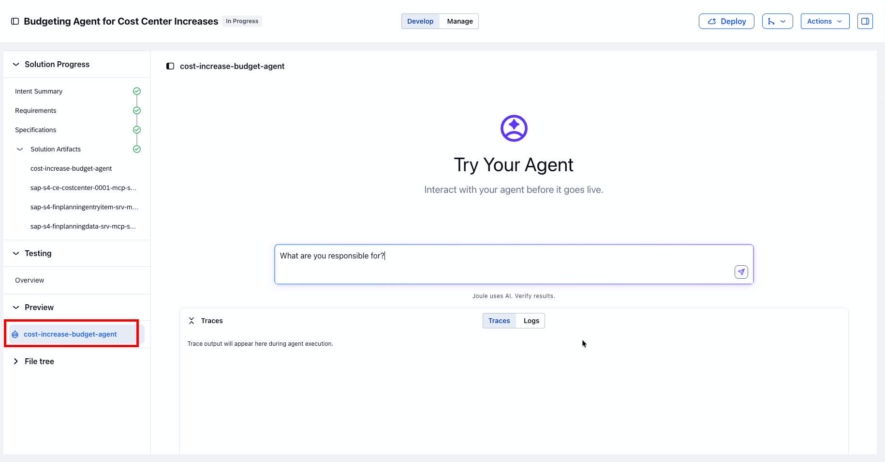

    You can do some further testing before deployment. You can try something like "How can I test this agent?" or "What are you responsible for?" to start the testing process.


### Deploy the Agent to the Development Landscape

With all tests passed and the validation score confirmed, the **Budgeting Agent for Cost Center Increases** is ready for deployment.

1. Choose **Deploy**. You can use either button shown below. Then confirm with **Deploy** again.

    <!-- border -->
    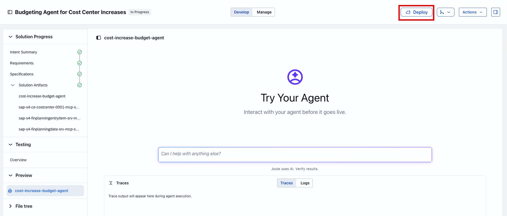

    <!-- border -->
    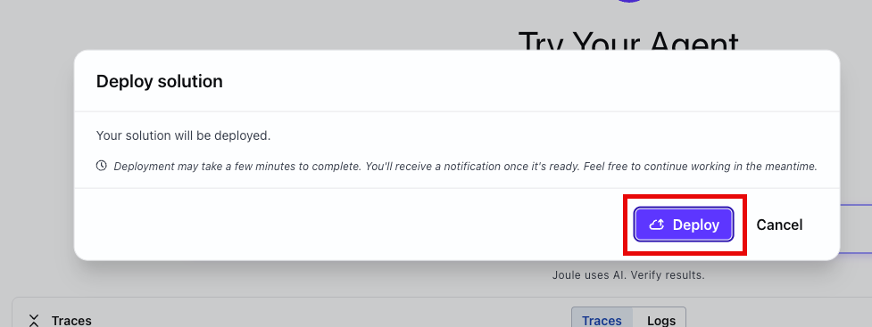

Joule Studio packages the agent and deploys it to the **SAP managed runtime service** on BAIP. Once deployment completes, the `deploy_result.json` file in the `specification/` folder is populated with the live deployment details (endpoint URL, runtime ID, deployment timestamp).

Your agent is now operational.

> For governance reasons, deployment to production is not done from within Joule Studio.

**How the agent works in production**

Once deployed, agents are automatically discoverable through Joule. When users ask questions that match the agent's area of responsibility, Joule routes the request to the agent. Users don't need to know that a custom agent exists or how to find it.


### Summary

You have completed the end-to-end creation and deployment of a Budgeting Agent for Cost Center Increases using SAP Joule Studio. In doing so, you have:

- Identified three types of budget disruption events (spot, sustained, cascade) and the manual pain points they create
- Written an effective intent statement that Joule Studio translated into a structured, production-ready solution
- Reviewed and validated the intent document, including the reflected intent, problem statement, measurable goals, and a recommended architecture with a high percentage intent fit score
- Evaluated a generated PRD, including product objectives, automation level, LLM boundaries, and operational guardrails
- Executed an automated validation suite
- Deployed the agent to the SAP managed runtime service

The agent turns what was previously a multi-day, error-prone manual process into a **guided, auditable, human-approved workflow** - from anomaly detection to approved budget write-back - with no manual development required.
