# Build a Sales Goal Advisor Agent with Joule Studio, CRM, and SAP SuccessFactors

## Prerequisites

- Access to **Joule Studio**
- Access to a **CRM system** with territory data, exposed via an API or OData endpoint
- Access to **SAP SuccessFactors** with the Goal Management module enabled and an API user configured for goal read and write operations

## You will learn

- How to identify a sales productivity workflow that is well-suited for agent automation
- How to write an effective **intent statement** for an agent
- How to review and validate the assets created, including the generated **Product Requirements Document (PRD)**
- How to deploy a production-ready Joule Agent to the SAP managed service

## Intro

>**IMPORTANT**
>
>**Welcome to the Agent lab**
>
>You are working with a pre-release version of the Joule Studio. This gives you an early look at our upcoming capabilities. Please keep the following in mind:
>
> - **Features are subject to change:** The UI, terminology, and functionality you see may differ from the final product.
> - **Educational use only:** This environment is designed for learning and experimentation, not for production use.
> - **Potential instability:** As a preview version, you may encounter occasional instability or unexpected behavior.

### Understand the Business Challenge

Setting quarterly goals is one of the most valuable things a sales rep can do - yet it is also one of the most often skipped or done poorly. Without easy access to territory data, goals tend to be too vague or disconnected from the rep's actual pipeline. Understanding where that friction lives explains why a structured, data-grounded approach makes all the difference.

**Three categories of quarterly development objective**

When a sales rep sits down to set quarterly goals, the meaningful targets typically fall into one of three patterns:

| Type | Description | Example |
|------|-------------|---------------------|
| **Pipeline objectives** | Goals tied to the current state of the opportunity pipeline - targeting conversion rates, deal progression, or revenue contribution from specific accounts or segments. | Opportunities in territory, account revenue potential |
| **Activity objectives** | Goals tied to engagement intensity - number of new accounts to activate, leads to qualify, or meetings to schedule within the territory. | Managed accounts count, leads in territory |
| **Growth objectives** | Goals tied to improvement relative to historical performance - identifying where the territory underperformed in previous quarters and setting measurable targets for recovery or acceleration. | Historical sales performance, territory trends |

**Current pain points**

The manual approach to goal-setting creates the following operational challenges:

- **No single territory view** - accounts, leads, opportunities, and history live across multiple reports the rep must manually compile.
- **Disconnected systems** - CRM and SuccessFactors aren't linked, forcing context-switching between data review and goal creation.
- **Generic goals** - without easy data access, reps set goals from intuition or copy last quarter's.
- **Inconsistent format** - manually created goals vary in quality and measurability, making quarter-end evaluation difficult.
- **Recurring overhead** - the same data-gathering exercise repeats every quarter, discouraging thorough goal-setting.

> The agent eliminates all five pain points: it retrieves territory data automatically, loads the rep's SuccessFactors profile, guides them through a structured goal-selection conversation, and writes confirmed goals directly to SuccessFactors.

In this tutorial, you build a Sales Goal Advisor Agent using Joule Studio. The agent connects live CRM data with the rep's SAP SuccessFactors profile and guides them through a structured conversation to set meaningful quarterly objectives grounded in real numbers. Once confirmed, the agent writes the goals directly into SAP SuccessFactors.

You'll follow the full Joule Studio development process - from a plain-language description of what you want to a deployed Python agent integrated with both a CRM system and SAP SuccessFactors via MCP.

> **About the scenario:** The rep and territory data are illustrative. The same pattern works for any organization using CRM territory data and SuccessFactors Goal Management.

> **Why this workflow?**  Goal-setting happens on a predictable schedule, pulls from two known systems, follows a clear conversation flow, and produces a defined output. That's exactly what Joule Studio agents are built for.

### Open Joule Studio and Define the Agent Intent

In this step, you select Agent as the solution type and describe what you want the agent to do. Joule Studio takes your intent and translates it into product requirements, a technical specification, and a complete implementation - no manual development required.

1. Open **Joule Studio**.

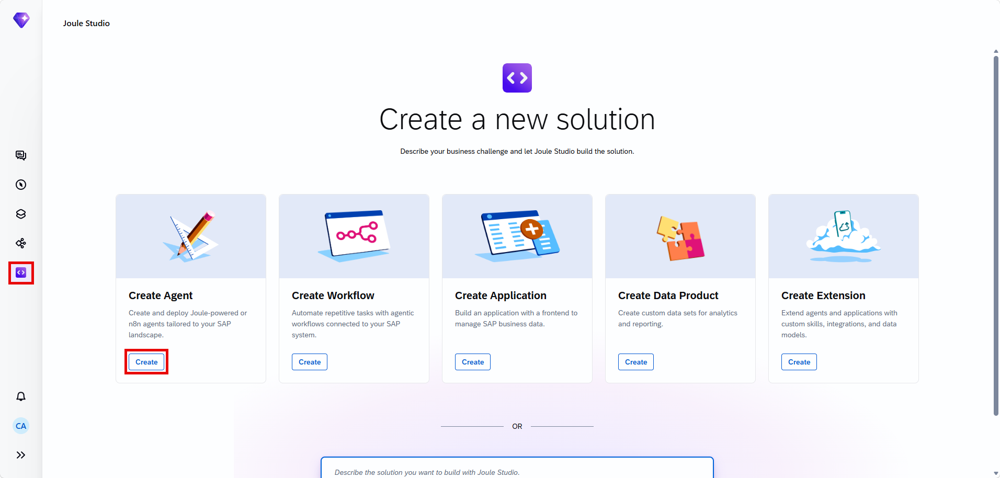

2. Select **Create** to open the **Create Agent** dialog.

3. Enter the agent name:

    ```
    Sales Goal Advisor
    ```

4. Enter the following intent statement in the description field:

   ```
   Please create an agent. The agent should interact with a sales representative in a step-by-step manner to help them create meaningful quarterly development objectives. The agent retrieves territory data from the CRM system - including managed accounts, leads in the territory, open opportunities, and historical sales performance - on a quarterly basis. It fetches the representative's current profile and existing goals from SAP SuccessFactors. Based on this combined data, the agent recommends relevant goal options across pipeline, activity, and growth dimensions, guides the representative through goal selection and refinement in a conversational flow, and upon explicit confirmation, creates the approved goals directly in SAP SuccessFactors.
   ```

5. Select **Quick Create** to skip clarifying questions and move directly to solution building. This adds *Fast Track* to the intent statement.
    
> Even with **Quick Create**, Joule will still ask you to confirm Business Goals & Success Criteria.

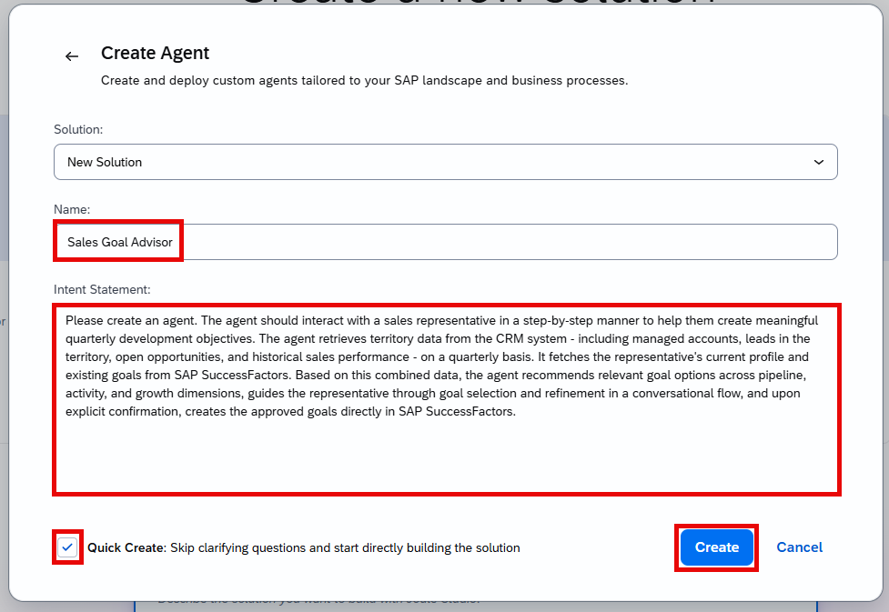

6. Select **Create** to proceed.

**Writing an effective intent statement**

A strong intent statement covers four dimensions: what the agent does, what data it works with, what decisions it supports, and what guardrails it must respect. This one covers all four - giving Joule Studio enough context to derive an accurate architecture without any technical input. If the generated interpretation doesn't match your expectations, refine the statement here before continuing.

7. Confirm the Business Goals.

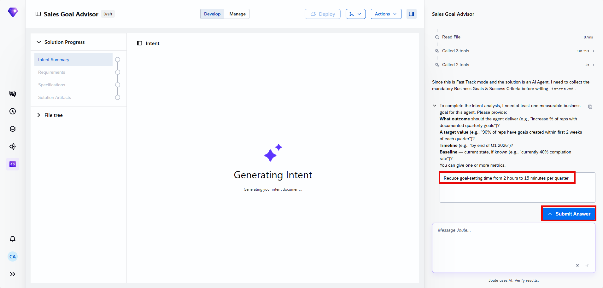

Even when **Quick Create** is selected, Joule will collect the mandatory Business Goals & Success Criteria before completing the intent analysis. Answer any additional clarifying questions to the best of your knowledge - these inputs help Joule define the success metrics and tailor the generated PRD.

### Review the Intent

1. After you submit the intent statement, Joule Studio generates an **intent.md** and presents a summary.
   
2. Under the **Intent Summary** tab, you may review the complete summary. This shows how Joule Studio interpreted your input. 

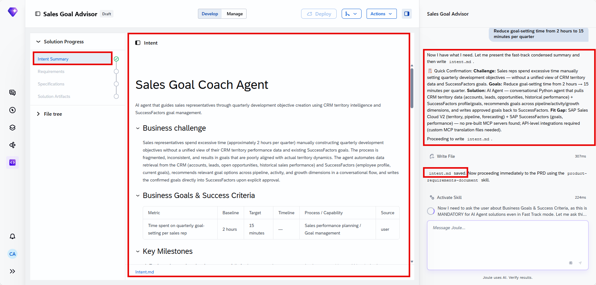

3. Verify that this matches your intent. If the summary is missing an element or describes a different scope, you can refine the intent statement and re-submit. 

4. You can find the **intent.md** file under **File tree** panel. 

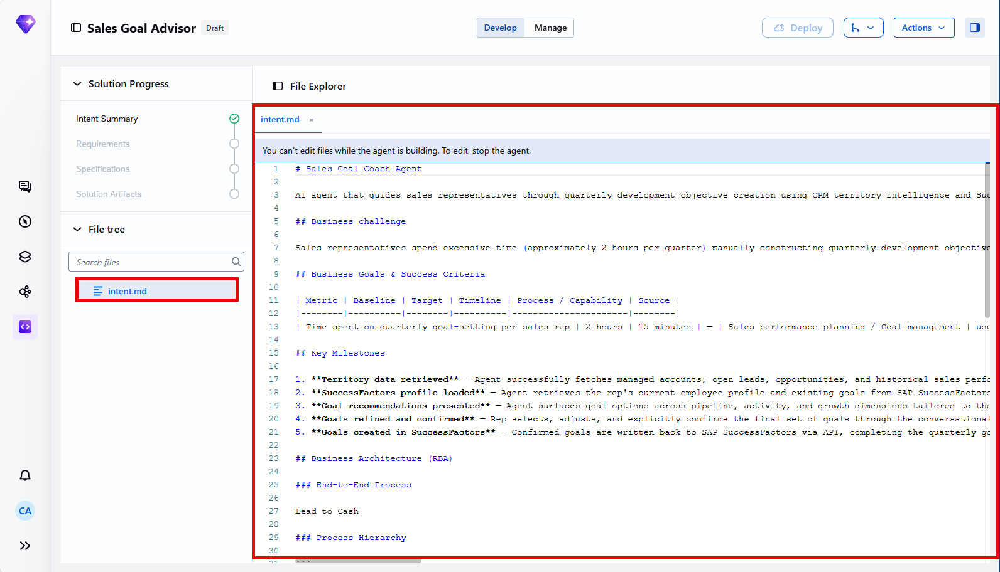

5. Scroll down to the **Fit Gap Analysis** and see what Joule has identified. 
   
6. Then you can scroll down to the **Recommended Solution**. It describes a Python-based AI agent that uses the Agent-to-Agent (A2A) and what it should be able to do. 
   
7. At the bottom of the solution card, review the **Intent fit** score. A score of 90% or higher confirms a very high degree of alignment between the proposed solution and your original intent statement. If the score is lower, consider refining your intent statement.

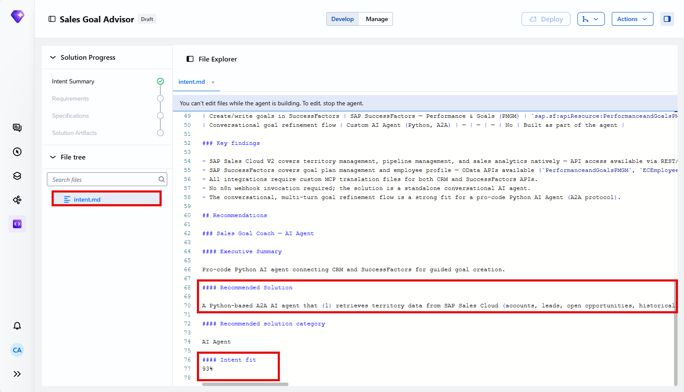


### Product Requirements Document

In the **Requirements** phase, Joule Studio generates a **Product Requirements Document (PRD)**. This is an important document that your are expected to review each section carefully. This document defines the agent's operational boundaries and becomes the source of truth for all subsequent phases.

1. Wait until the requirements have been generated.

2. Choose **Requirements** under **Solution Progress** panel. This opens the low-code view of the PRD. 

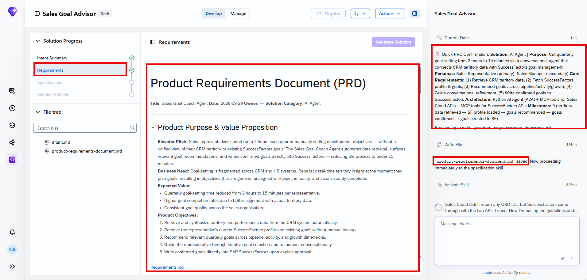

3. To access the raw Markdown file, move to the **File tree** panel - this is the code view of the same document.

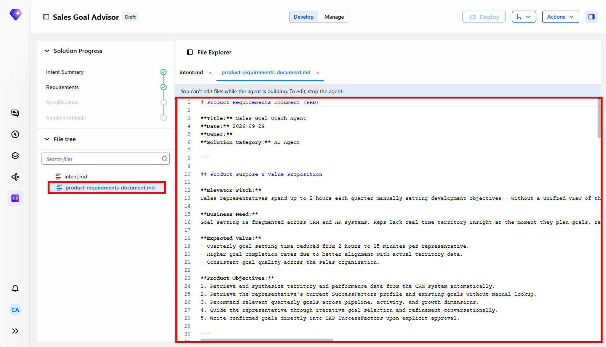

The Business Context section maps your intent to the actual business process - it identifies personas (e.g., sales rep, manager), pain points, success metrics, and guardrails. Review this section carefully: it defines the operational boundaries the agent will respect throughout all subsequent phases.

**Product Purpose and Value Proposition**

At the top of the document, you will find the elevator pitch, the business need and expected value described. The product objectives are also listed.

**Must-Have Requirements**

4. Scroll down to the **Requirements**.

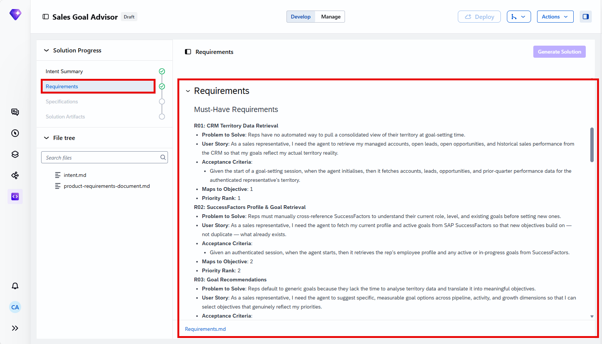

This section provides ranked requirements, with their user stories and acceptance criteria.

**Automation and Agent Behavior**

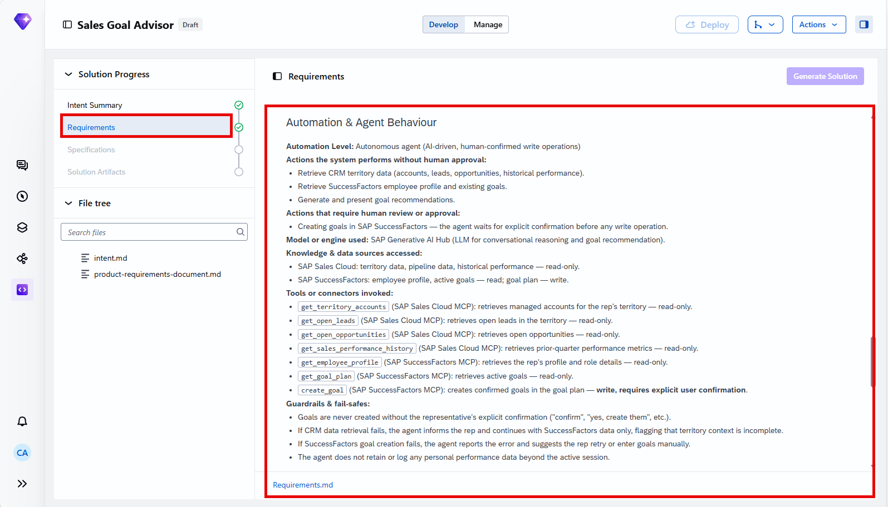

This section is critical - it defines exactly what the agent does autonomously, what requires a human decision, and what guardrails are in place.

The agent operates at a **hybrid automation level**:

- *Autonomous actions (no human required)*, such as fetch SuccessFactors employee profile and existing goals
- *Human approval required*, such as writing any goal to SuccessFactors

### Inspect the Generated Specification

In the **Specification** phase, Joule Studio translates the PRD into a generated file tree: a complete, structured, and reviewable set of assets and configuration files. No code has been written yet; this is the blueprint.

1. Wait for the specification generation to complete. Review the summary of what has been created so far.

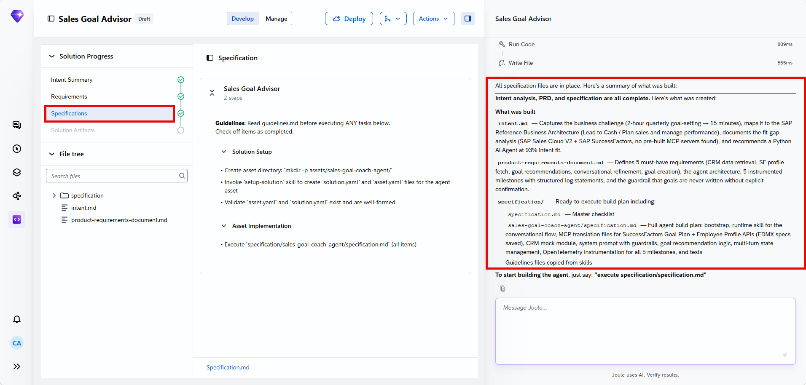

The entire specification is transparent and reviewable **before any deployment is triggered**.

### Generate the Solution

1. Once you have reviewed the specification, type execute specification/specification.md in the message window to trigger solution generation.

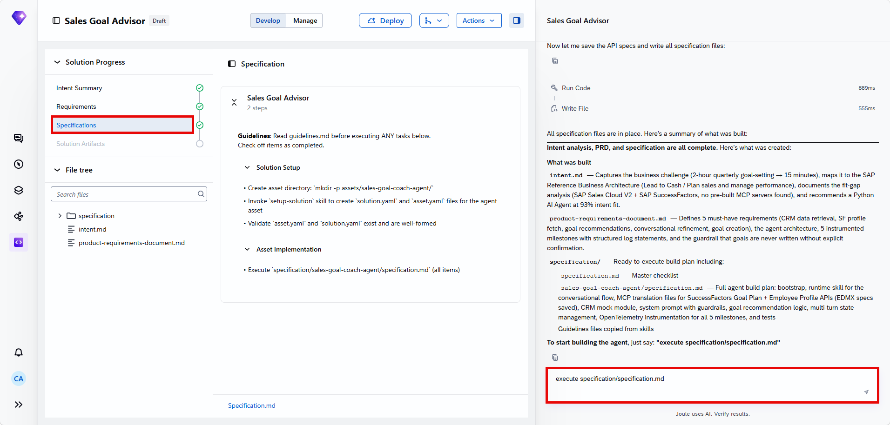

In the **Solution Artifacts** phase, Joule Studio executes the specification and generates the complete, runnable solution: the anomaly detection engine, scenario calculation logic, chart generation, and approval-gated write-back - with no manual development required. Automatic tests will be created and executed.

2. Wait for the solution generation to complete before proceeding. You can find the agent under **Solution Artifacts**.

During this phase, Joule Studio:

- Scaffolds the Python agent and the MCP server packages from the assets/ file tree
- Wires up the CRM and SuccessFactors Goal Management API bindings
- Configures the SAP Generative AI Hub connection for conversational guidance and goal narration
- Builds the territory metrics aggregation engine that structures CRM data as grounded inputs to the LLM
- Applies the operational guardrails, including the confirmation gate before any SuccessFactors write
- Instruments all agent actions with audit logging - data retrieval, goal recommendations, conversation turns, and write-backs

**Reviewing the Agent Definition**

3. Select the agent under **Solution Artifacts** to open its definition. In the low-code view you can see:
   
- The LLM configuration (e.g., sap/anthropic--claude-4.5-sonnet)
- Agent Configurations: circuit-breaker threshold, thread TTL, summarization trigger
- The MCP Servers that allow the agent to read and write SuccessFactors Goal Plans as well as to retrieve the rep's employee profile.

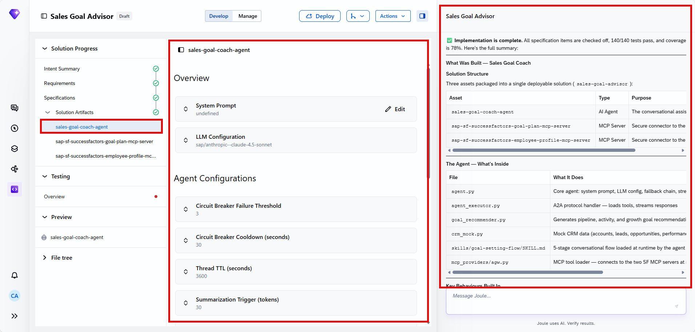

4. In the **Evaluation** section you can generate evaluation scenarios for this agent based on your intent.

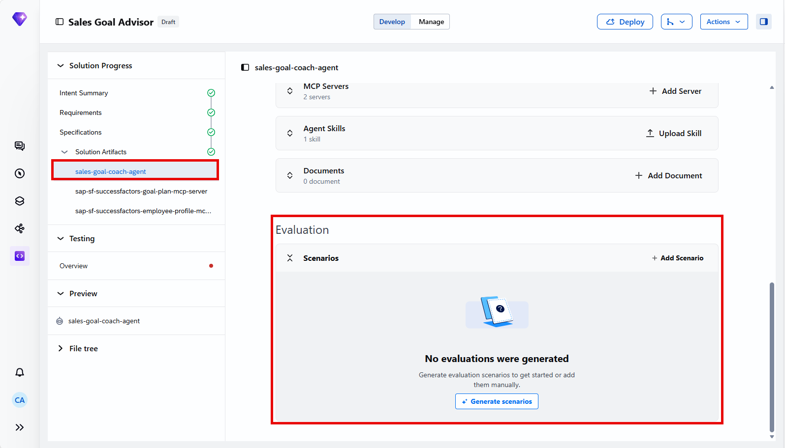
  
5. To see the generated Python code, move to the pro-code (Files) view.

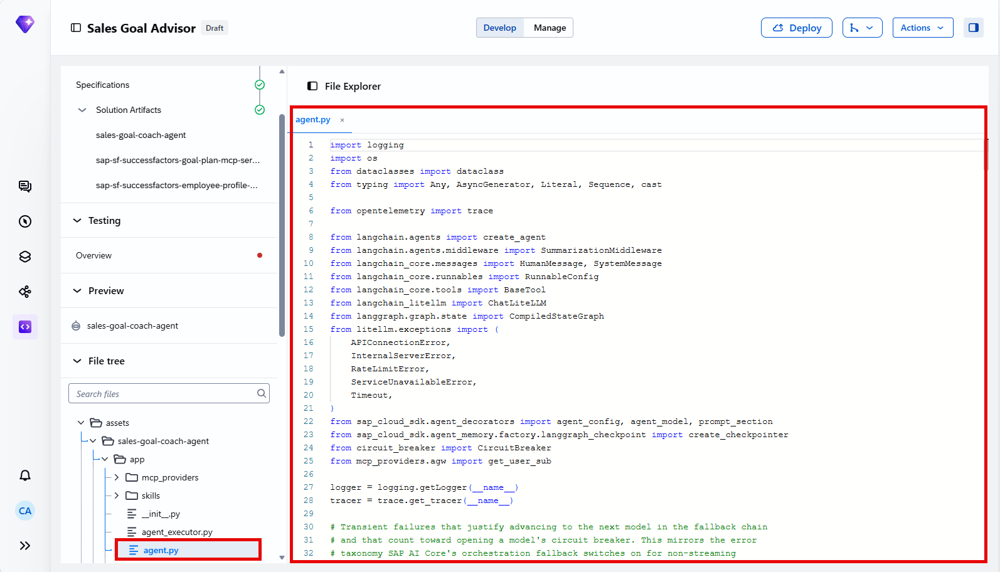

**Reviewing the MCP Servers**

Select MCP Servers in the agent definition to see the servers that were configured automatically. Each one gives the agent access to a specific system:

- They connect to the SAP SuccessFactors Goal Plan OData API and Employee Profile OData API allowing the agent to read the rep's existing goals and write newly confirmed goals back to SuccessFactors and to retrieve the rep's profile at the start of each session.

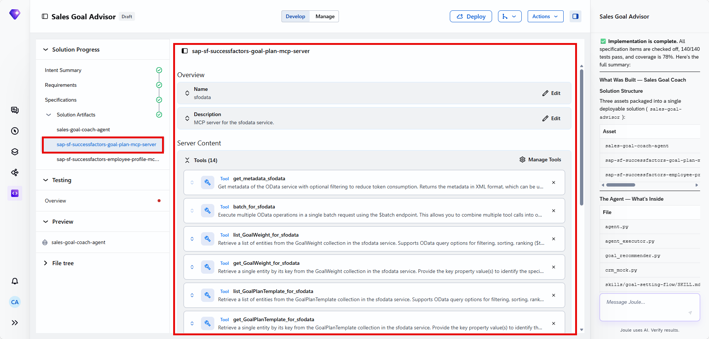
  
No configuration is required: Joule Studio generated and wired up all servers from the specification.

Once Joule confirms the solution build is complete, proceed to **Testing Overview** to see the automated test results.

### Validate the Agent with Automated Tests

The **Testing** phase is triggered automatically by Joule once the solution build is complete. It runs an automated validation suite derived from the specification - you do not need to initiate it manually. Wait for Joule to confirm that testing has finished before proceeding.

1.	Once testing is complete, open **Overview** under **Testing** panel. Review the results and compare the test categories to your specification to verify all requirements have been validated.

2. Verify that all tests pass before proceeding to deployment.

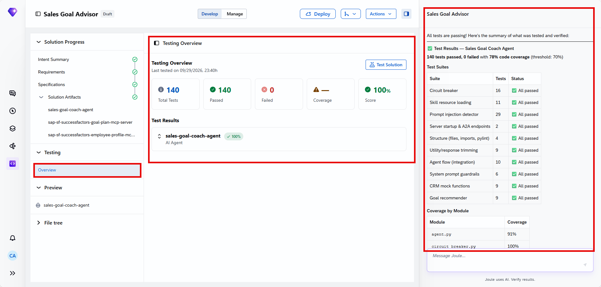

> If any test fails, Joule will usually try to fix it automatically. If it gets stuck, you might converse with Joule to help fix the problem.

3. Select the agent under **Preview** panel.

4. In the chat field, enter a prompt that does not require live tool calls. For example: What are you responsible for? The agent will respond with a description of its capabilities without needing to connect to CRM or SuccessFactors.

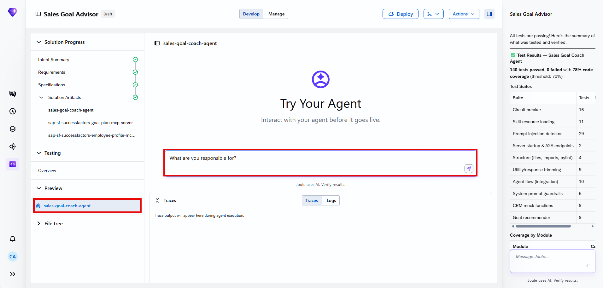

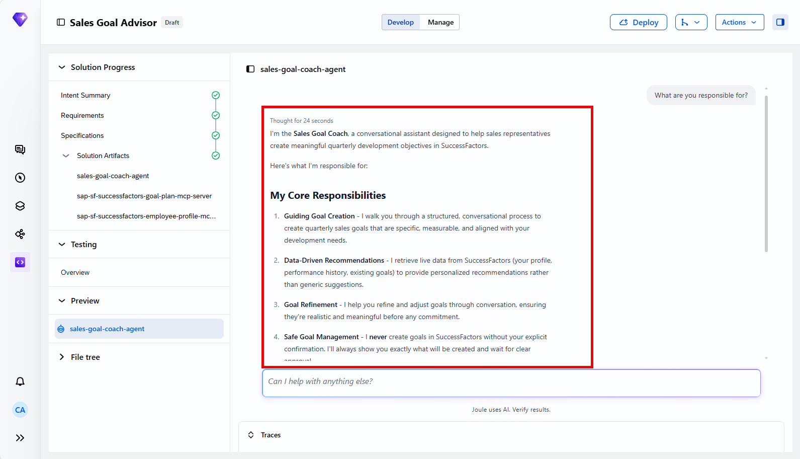

You can do some further testing before deployment.

### Deploy the Agent to Development Landscape

With all tests passed and the validation score confirmed, the **Agent** is ready for deployment.

1. Choose **Deploy**. Then confirm with **Deploy** again.
   
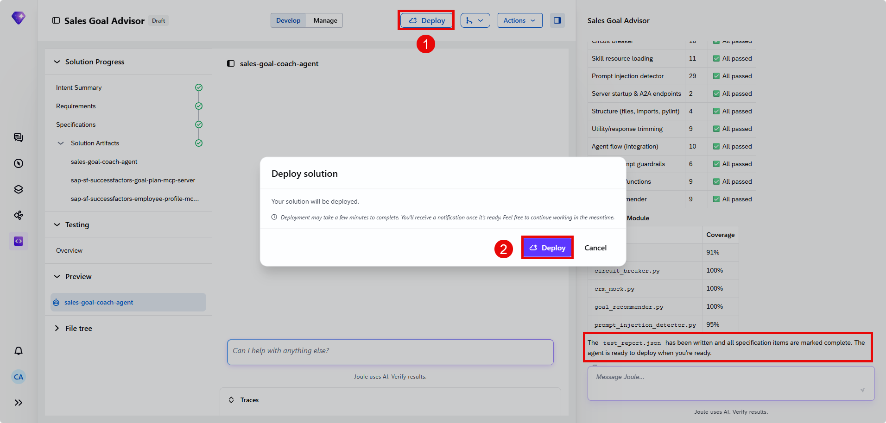

Joule Studio packages the agent and deploys it to the **SAP managed service** on BAIP. Once deployment completes, the `deploy_result.json` file in the `specification/` folder is populated with the live deployment details (endpoint URL, runtime ID, deployment timestamp).

Your agent is now operational.

*Screenshot of successful deployment result (the deploy_result.json populated state, or the Manage tab showing the live deployment) with a caption to include*

> If you are working in a team or want to version-control the generated code, Joule Studio supports GitHub sync. You can find this option under **Actions** in the top bar.

> For governance reasons, deployment to production is not done from within Joule Studio.

**How the agent works in production**

Once deployed, agents are automatically discoverable through Joule. When users ask questions that match the agent's area of responsibility, Joule routes the request to the agent. Users don't need to know that a custom agent exists or how to find it.

**Monitoring the Agent**

Once deployed, switch to the **Manage** tab in Joule Studio to access governance and monitoring. Here you can view runtime status, active deployments, usage metrics, and audit logs.

*Screenshot of the Manage tab to include*

### Summary

You have completed the end-to-end design and deployment of a Sales Goal Advisor Agent using Joule Studio. In doing so, you have:

- Identified the three dimensions of quarterly sales development objectives (pipeline, activity, growth) and the manual pain points that prevent data-grounded goal-setting today
- Written an effective intent statement that Joule Studio translated into a structured, production-ready solution
- Reviewed and validated an Idea Board with measurable goals and a recommended MCP-server architecture
- Evaluated a generated PRD defining product objectives, automation level, LLM boundaries, and operational guardrails
- Reviewed automated test coverage across data retrieval, goal recommendations, conversational flow, and SuccessFactors write-back
- Deployed the agent to the SAP managed service

The agent turns what was previously a fragmented, manual, quarterly exercise into a structured, data-grounded, conversational workflow from territory data retrieval to confirmed goals written directly into SuccessFactors with no manual development required.
