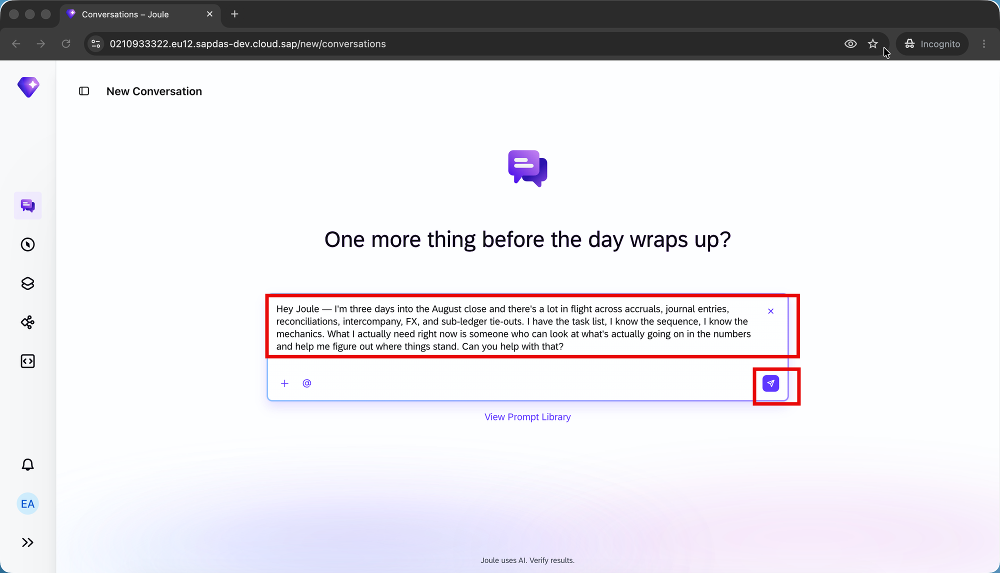
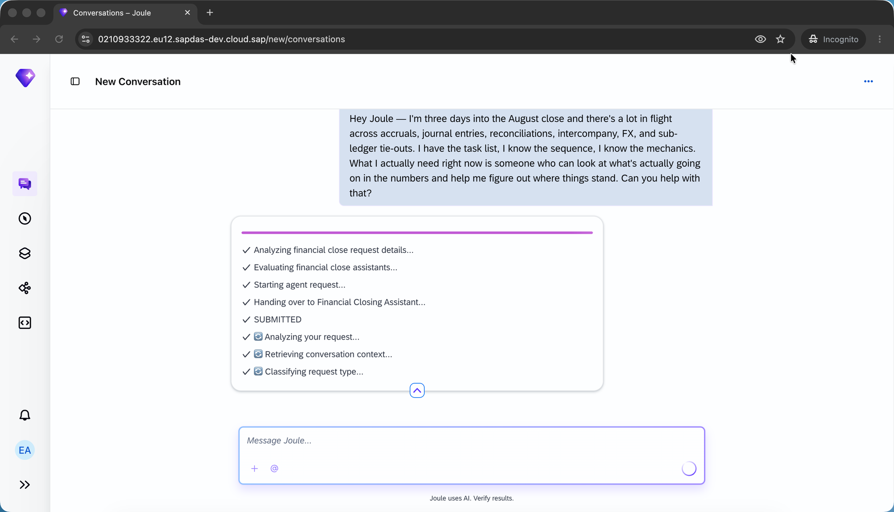
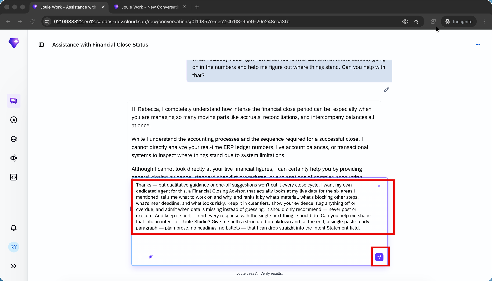
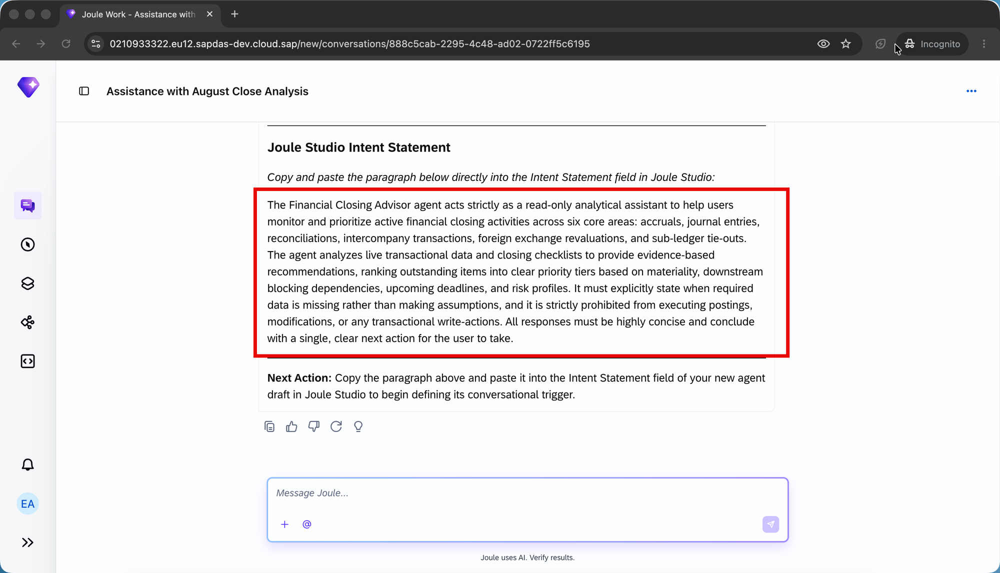

# Draft a Financial Close Recommendation Agent Intent with Joule Work

## Prerequisites

- Access to **SAP Joule Work**
- Access to an **SAP S/4HANA Cloud** system with a live financial close in progress (used only as context for the conversation; nothing is written to S/4HANA in this tutorial)
- Familiarity with period-end or year-end financial closing processes
- Recommended follow-up: the companion tutorial [Guide Financial Closing Activities with an Intelligent Closing Advisor Agent](../financial-closing-advisor-agent/financial-closing-advisor-agent.md) — this tutorial produces the intent paragraph you will paste into that build tutorial.


## You will learn

- How to use **Joule Work** to surface, in one natural-language question, that a real-time financial close advisor is not available out of the box in your tenant
- How to describe the agent you actually need — its scope, prioritization logic, and guardrails — and have Joule Work return both a structured breakdown and a paste-ready intent paragraph in a single follow-up turn


## Intro

You are a financial controller three days into the August month-end close. Activity is happening everywhere — accruals, journal entries, reconciliations, intercompany, FX, sub-ledger tie-outs — and the task list, sequence, and mechanics are all under control. What is not under control is the judgment layer sitting on top of it: which items in the numbers actually need your attention this hour, in what order, and why.

You want a dedicated agent for this — one you own, one that reads your live close data, one that only recommends and never posts, one that always ends with the single next thing to do. In this tutorial you will use **Joule Work** to draft the intent statement for that agent in two natural-language turns. In the companion tutorial [Guide Financial Closing Activities with an Intelligent Closing Advisor Agent](../financial-closing-advisor-agent/financial-closing-advisor-agent.md), you will paste that intent into **Joule Studio** and follow the intent-based development process to build, test, and deploy the agent, then return to Joule Work to consume it on close day.

The two turns of the conversation below are the pattern: **surface the gap → describe the agent you want to own and get back a paste-ready paragraph in one turn**. Every turn is a natural-language message a controller can send without knowing anything about the APIs or services underneath.

> **About Joule Work response variability**: Joule Work is an LLM-driven surface, and Turn 1 responses vary run to run. In most tenants, Joule Work will acknowledge that live financial data is out of reach and offer qualitative guidance or a generic best-practice sequence. Occasionally it may list closing-related agents that already exist in your tenant, or offer to execute individual close tasks directly. All three are valid starting points — Turn 2 works the same regardless of what Turn 1 returns, because it describes the agent you want to own from scratch. If your Turn 1 response mentions existing agents, simply adapt Turn 2's opening line to acknowledge them ("Thanks, but those agents aren't mine to change and I don't know their data wiring — I want my own dedicated agent for this...").


---

### Turn 1: Ask the Real Close-Day Question

Open Joule Work and start a new conversation. Ask the question you would ask any experienced colleague on close day — name what is in flight, acknowledge the tools you already have, and ask for help figuring out where things stand:

```
Hey Joule — I'm three days into the August close and there's a lot in flight across accruals, journal entries, reconciliations, intercompany, FX, and sub-ledger tie-outs. I have the task list, I know the sequence, I know the mechanics. What I actually need right now is someone who can look at what's actually going on in the numbers and help me figure out where things stand. Can you help with that?
```



Joule Work reads your question and typically responds along the following lines — the exact wording will vary run to run, but the shape is consistent:



- **Acknowledges the close context** — Joule Work confirms it understands you are in the middle of the close and has parsed the six areas you named.
- **Discloses a capability limitation** — Joule Work states, in some form, that it does not have direct access to your live transactional data, ledger balances, or real-time close status.
- **Offers a fallback** — Joule Work offers qualitative guidance, a generic best-practice sequence, links to standard reports, or a menu of individual close tasks it can execute directly.

The important takeaway from Turn 1 is not the specific offer — it is that **you cannot get, out of the box, an agent that continuously reads your live close data and gives you prioritized recommendations with reasoning**. That is the gap you will describe in Turn 2.

> **Tip: Read Turn 1 as a specification, not a dead end**
> Whatever Joule Work returns in Turn 1 — a limitation acknowledgment, a menu of fallback options, or even a list of existing agents in your tenant — the underlying signal is the same: the specific agent you need is not one you can just pick off the shelf. That signal is what makes Turn 2 legitimate.


---

### Turn 2: Describe the Agent and Ask for a Paste-Ready Paragraph

Same conversation. In this turn you tell Joule Work exactly what agent you want to build in Joule Studio — its scope, its prioritization logic, and its guardrails — and you ask for both a structured breakdown **and** a paste-ready intent paragraph in the same response:

```
Thanks — but qualitative guidance or one-off suggestions won't cut it every close cycle. I want my own dedicated agent for this, a Financial Close Recommendation Agent, that actually looks at my live data for the six areas I mentioned, tells me what to work on and why, and ranks it by what's material, what's blocking other steps, what's near deadline, and what looks risky. Keep it in clear tiers, show your evidence, flag anything off or overdue, and admit when data is missing instead of guessing. It should only recommend — never post or execute. And keep it short — end every response with the single next thing I should do. Can you help me shape that into an intent for Joule Studio? Give me both a structured breakdown and, at the end, a single paste-ready paragraph — plain prose, no headings, no bullets — that I can drop straight into the Intent Statement field.
```



Joule Work returns two artefacts in one response — a structured breakdown of the agent (typically organised as sections for scope, prioritization framework, guardrails, and output format) followed by a single paste-ready intent paragraph at the end:



Skim the structured breakdown to confirm every anchor from your prompt is present, then focus on the paragraph. The paragraph is what you will paste into Joule Studio, so make sure it contains all of the following:

- **Agent name**: Financial Close Recommendation Agent
- **Scope**: six close areas (accruals, journal entries, reconciliations, intercompany, FX, sub-ledger-to-GL tie-outs)
- **Prioritization**: materiality, blocking dependencies, deadline proximity, risk
- **Output format**: clear tiers with rationale and cited evidence
- **Anomaly handling**: flag off or overdue items
- **Missing-data behaviour**: admit rather than guess
- **Execution boundary**: recommends only, never posts or executes
- **Response shape**: concise, ends with a single next action

If any anchor is missing from the paragraph, ask Joule Work in a follow-up message to reinstate it before copying.

Copy the paragraph to your clipboard. This is the intent statement you will paste into **Joule Studio** in the companion tutorial to build your **Financial Close Recommendation Agent**.

> **Tip: Why "recommends only" and "single next action" belong in the intent, not the runtime**
> These two guardrails are the difference between an agent controllers will actually use and one they will disable within a week. Naming them in the intent — rather than trying to bolt them on later in Joule Studio — ensures they are treated as design constraints, not afterthoughts, when Joule Studio scaffolds the agent.

> **Tip: The exact wording of your paragraph will vary from Joule Work run to run**
> Joule Work is an LLM — the paragraph you get will not be word-for-word identical to another controller's, and probably not identical to what you would get on a second run either. That is expected. Joule Studio's Create Agent flow parses meaning, not exact strings. As long as every capability anchor and every guardrail is present in prose, the paragraph is paste-ready.


---

### Next: Paste Your Intent into Joule Studio

You now have the intent paragraph on your clipboard. The rest of the build happens in **Joule Studio**, following the intent-based development process — from your pasted intent, through an Idea Board review, a full Product Requirements Document, a technical specification, generated agent code, automated tests, and finally deployment.

Continue with the companion tutorial [Guide Financial Closing Activities with an Intelligent Closing Advisor Agent](../financial-closing-advisor-agent/financial-closing-advisor-agent.md). Open Joule Studio, start a new agent solution, and paste your paragraph into the **Intent Statement** field. From there, the tutorial walks you through each phase until you have a deployed **Financial Close Recommendation Agent** you can invoke back in Joule Work on close day.


---

## Summary

You just drafted a Joule Studio-ready intent statement for a **Financial Close Recommendation Agent** — entirely inside a Joule Work conversation, using two natural-language turns:

1. **Ask the real close-day question** — you named what was in flight across the six close areas, acknowledged that the task list, sequence, and mechanics were already handled, and asked Joule Work for help figuring out where things stand in the actual numbers. Joule Work's response surfaced the gap: the specific advisor you need is not available off the shelf.
2. **Describe the agent and ask for a paste-ready paragraph** — you named the agent (Financial Close Recommendation Agent), the six close areas it should look at, the four prioritization dimensions (materiality, blocking dependencies, deadline, risk), the tiered output with evidence, the anomaly and overdue flagging, the never-guess rule, the recommends-only boundary, and the single-next-action ending — and you asked Joule Work to return both a structured breakdown and a single paste-ready paragraph. Joule Work returned both in the same response.

Every phrase in the final paragraph traces back to something you or Joule Work said in this conversation. That grounding is what makes the resulting agent both aligned with the way you actually close and portable to your Joule Studio build — and it is why the paragraph on your clipboard is ready for the companion tutorial.
